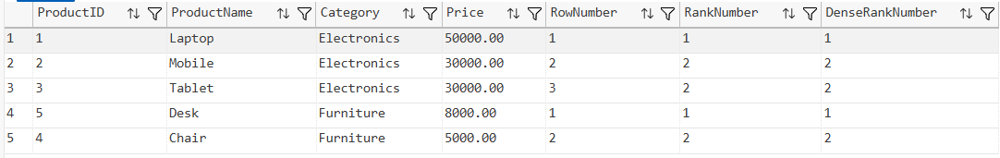
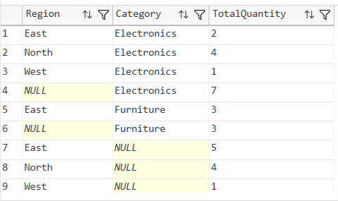
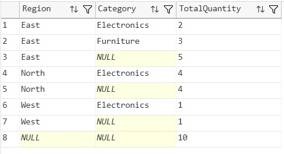
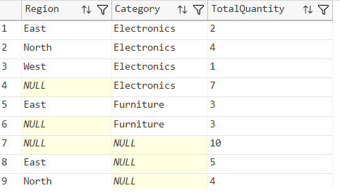
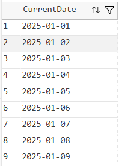
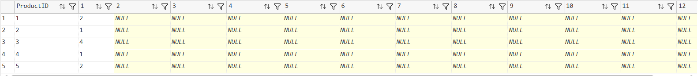
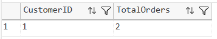

# SQL Exercise - Advanced Concepts

## Developer Info
- **Name**: Nirnay Ghosh
- **Assignment**: Cognizant Digital Nurture 5.0
- **Skill**: Advanced SQL Server Concepts

---

## Problem Statement

This exercise demonstrates the implementation of various advanced SQL Server concepts used in real-world database systems, including:

- Ranking Functions
- GROUPING SETS
- ROLLUP
- CUBE
- Recursive Common Table Expressions (CTE)
- PIVOT Operations
- Common Table Expressions (CTE)

---

## Objectives

- Implement SQL Server ranking functions
- Perform multidimensional aggregation using GROUPING SETS, ROLLUP, and CUBE
- Generate recursive data using Recursive CTE
- Transform rows into columns using PIVOT
- Use CTEs for modular and readable query design

---

## Database Schema

The following tables were created for the exercises:

### Tables Used

- **Products**
- **Customers**
- **Orders**
- **OrderDetails**

### Relationships

- One Customer can place many Orders
- One Order can contain many Products
- OrderDetails acts as a junction table between Orders and Products

---

## Exercises Implemented

### Exercise 1 - Ranking Functions

Implemented:

- `ROW_NUMBER()`
- `RANK()`
- `DENSE_RANK()`

Purpose:
- Assign sequential row numbers
- Handle ties using ranking functions
- Compare ranking behavior within product categories

---

### Exercise 2A - GROUPING SETS

Purpose:
- Generate multiple aggregation levels in a single query
- Summarize sales by:
  - Region
  - Category
  - Region and Category

---

### Exercise 2B - ROLLUP

Purpose:
- Produce hierarchical subtotals
- Generate grand totals automatically

---

### Exercise 2C - CUBE

Purpose:
- Generate all possible aggregation combinations
- Perform multidimensional analysis

---

### Exercise 3 - Recursive CTE

Purpose:
- Generate calendar dates recursively
- Demonstrate self-referencing query structures

---

### Exercise 4 - PIVOT

Purpose:
- Convert row-based sales data into column-based format
- Generate month-wise sales reports

---

### Exercise 5 - Common Table Expression (CTE)

Purpose:
- Calculate order counts for customers
- Identify customers having more than one order

---

## SQL Concepts Covered

| Concept | Description |
|----------|-------------|
| ROW_NUMBER() | Assigns unique sequential numbers |
| RANK() | Assigns rank with gaps |
| DENSE_RANK() | Assigns rank without gaps |
| GROUPING SETS | Multiple grouping combinations |
| ROLLUP | Hierarchical subtotals |
| CUBE | All aggregation combinations |
| Recursive CTE | Recursive query generation |
| PIVOT | Row-to-column transformation |
| CTE | Temporary named result set |

---

## Output Screenshots

### Exercise 1 - Ranking Functions



---

### Exercise 2A - GROUPING SETS



---

### Exercise 2B - ROLLUP



---

### Exercise 2C - CUBE



---

### Exercise 3 - Recursive CTE



---

### Exercise 4 - Month Wise Sales Pivot



---

### Exercise 5 - Customer Order Count CTE



---

## Project Structure

```text
AdvancedSQLServer
│
└── 1.SQLExercise-Advancedconcepts
    │
    ├── Queries.sql
    │
    ├── Output
    │   ├── rownumberrankdenserank.png
    │   ├── groupingsets.png
    │   ├── rollup.png
    │   ├── cube.png
    │   ├── calendarcte.png
    │   ├── monthwisesales.png
    │   └── customercte.png
    │
    └── README.md
```

---

## How to Run

### Connect to SQL Server

```sql
Server Name: localhost\SQLEXPRESS
Authentication: Windows Authentication
```

### Execute Script

Open:

```text
AdvancedSQLserver/1.SQLExercise-Advancedconcepts/Queries.sql
```

Execute the script in:

- SQL Server Management Studio (SSMS)
- Azure Data Studio
- Visual Studio Code with SQL Server Extension

---

## Files Included

| File | Description |
|--------|-------------|
| Queries.sql | Complete SQL implementation |
| README.md | Documentation |
| Output Folder | Screenshots of query outputs |

---

## Learning Outcomes

After completing this exercise, the following concepts were successfully demonstrated:

- Window Functions
- Advanced Aggregation Techniques
- Recursive Query Processing
- Data Transformation using PIVOT
- Common Table Expressions
- SQL Server Reporting Techniques

---