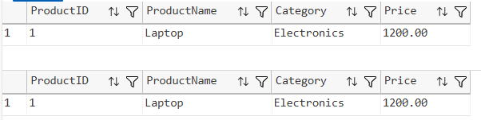
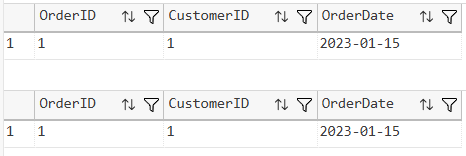
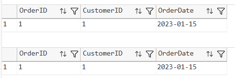
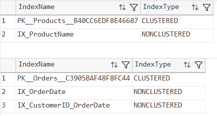

# SQL Exercise - Indexes

## Developer Info

* **Name**: Nirnay Ghosh
* **Assignment**: Cognizant Digital Nurture 5.0
* **Skill**: SQL Server Indexes

---

## Problem Statement

Indexes are database objects used to improve query performance by reducing the amount of data scanned during retrieval operations.

This exercise demonstrates the creation and usage of:

* Non-Clustered Index
* Index on OrderDate
* Composite Index

and compares query execution before and after index creation.

---

## Objectives

* Create and use SQL Server indexes
* Improve query retrieval performance
* Understand index optimization techniques
* Demonstrate the usage of composite indexes

---

## Database Schema

The following tables were created for the exercise:

### Tables Used

* Customers
* Products
* Orders
* OrderDetails

### Relationships

* One Customer can place multiple Orders
* One Order can contain multiple Products
* OrderDetails acts as a junction table between Orders and Products

---

## Exercises Implemented

### Exercise 1 - Non-Clustered Index

Index Created:

```sql
CREATE NONCLUSTERED INDEX IX_ProductName
ON Products(ProductName);
```

Purpose:

* Optimize product searches using ProductName
* Reduce table scanning during lookups

---

### Exercise 2 - OrderDate Index

Index Created:

```sql
CREATE NONCLUSTERED INDEX IX_OrderDate
ON Orders(OrderDate);
```

Purpose:

* Improve date-based order searches
* Optimize retrieval of orders placed on a specific date

---

### Exercise 3 - Composite Index

Index Created:

```sql
CREATE NONCLUSTERED INDEX IX_CustomerID_OrderDate
ON Orders(CustomerID, OrderDate);
```

Purpose:

* Improve filtering using multiple columns
* Optimize customer and order date based searches

---

## Indexes Created

| Index Name              | Type                    | Table    |
| ----------------------- | ----------------------- | -------- |
| IX_ProductName          | Non-Clustered           | Products |
| IX_OrderDate            | Non-Clustered           | Orders   |
| IX_CustomerID_OrderDate | Composite Non-Clustered | Orders   |

---

## Output Screenshots

### Exercise 1 - Product Name Index



---

### Exercise 2 - Order Date Index



---

### Exercise 3 - Composite Index



---

### Index Verification



---

## Project Structure

```text
Advanced SQL Server
│
└── 2. SQL Exercise-Indexes
    │
    ├── Queries.sql
    │
    ├── Output
    │   ├── productnameindex.png
    │   ├── orderdateindex.png
    │   ├── compositeindex.png
    │   └── verifyindexes.png
    │
    └── README.md
```

---

## How to Run

### Connect to SQL Server

```text
Server Name: localhost\SQLEXPRESS
Authentication: Windows Authentication
```

### Execute Script

Open:

```text
Advanced SQL Server/2. SQL Exercise-Indexes/Queries.sql
```

Execute the script using:

* SQL Server Management Studio (SSMS)
* Azure Data Studio
* Visual Studio Code with SQL Server Extension

---

## Files Included

| File          | Description                 |
| ------------- | --------------------------- |
| Queries.sql   | Complete SQL implementation |
| README.md     | Documentation               |
| Output Folder | Query output screenshots    |

---

## Learning Outcomes

After completing this exercise, the following concepts were successfully demonstrated:

* Non-Clustered Indexes
* Composite Indexes
* Query Optimization
* SQL Server Index Management
* Database Performance Enhancement

---
