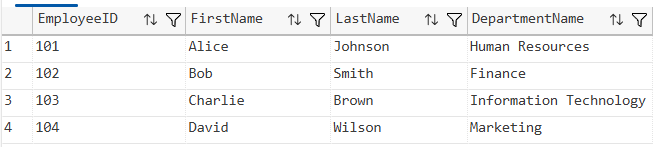
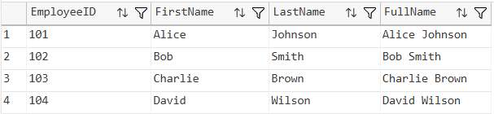
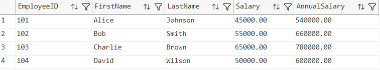
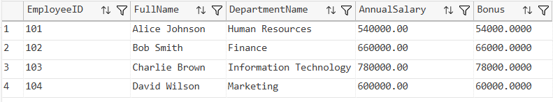
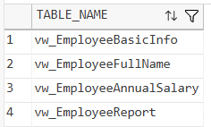

# SQL Exercise - Views

## Developer Info
- **Name**: Nirnay Ghosh
- **Assignment**: Cognizant Digital Nurture 5.0
- **Skill**: SQL Server Views

---

## Problem Statement

Views are virtual tables in SQL Server that simplify complex queries and provide customized representations of data.

This exercise demonstrates the creation of views using:

- Table Joins
- Computed Columns
- Salary Calculations
- Employee Reporting

---

## Objectives

- Create SQL Server Views
- Perform joins within views
- Use computed columns
- Generate employee reports using views

---

## Database Schema

### Tables Used

- Departments
- Employees

### Relationships

- One Department can have multiple Employees
- Each Employee belongs to one Department

---

## Exercises Implemented

### Exercise 1 - Simple View

View Created:

```sql
vw_EmployeeBasicInfo
```

Purpose:

- Display employee details
- Join Employees and Departments tables
- Show department information along with employee records

---

### Exercise 2 - Computed Column - Full Name

View Created:

```sql
vw_EmployeeFullName
```

Computed Column:

```sql
FirstName + ' ' + LastName AS FullName
```

Purpose:

- Generate employee full names
- Demonstrate computed columns in views

---

### Exercise 3 - Computed Column - Annual Salary

View Created:

```sql
vw_EmployeeAnnualSalary
```

Computed Column:

```sql
Salary * 12 AS AnnualSalary
```

Purpose:

- Calculate annual employee salary
- Perform arithmetic calculations within views

---

### Exercise 4 - Employee Report View

View Created:

```sql
vw_EmployeeReport
```

Computed Columns:

```sql
FullName
AnnualSalary
Bonus
```

Bonus Calculation:

```sql
(Salary * 12) * 0.10 AS Bonus
```

Purpose:

- Generate employee reports
- Combine multiple computed columns
- Provide salary and bonus information

---

## Views Created

| View Name | Purpose |
|------------|----------|
| vw_EmployeeBasicInfo | Employee and Department Details |
| vw_EmployeeFullName | Employee Full Name |
| vw_EmployeeAnnualSalary | Annual Salary Calculation |
| vw_EmployeeReport | Employee Reporting View |

---

## Output Screenshots

### Exercise 1 - Employee Basic Information



---

### Exercise 2 - Employee Full Name



---

### Exercise 3 - Employee Annual Salary



---

### Exercise 4 - Employee Report



---

### View Verification



---

## Project Structure

```text
1.AdvancedSQLserver
│
└── 3.SQLExercise-Views
    │
    ├── Queries.sql
    │
    ├── Output
    │   ├── employeebasicinfo.png
    │   ├── employeefullname.png
    │   ├── employeeannualsalary.png
    │   ├── employeereport.png
    │   └── verifyviews.png
    │
    └── README.md
```

---

## How to Run

```text
Server Name: localhost\SQLEXPRESS
Authentication: Windows Authentication
```

Open:

```text
1.AdvancedSQLserver/3.SQLExercise-Views/Queries.sql
```

Execute the script using:

- SQL Server Management Studio (SSMS)
- Azure Data Studio
- Visual Studio Code with SQL Server Extension

---

## Files Included

| File | Description |
|------|-------------|
| Queries.sql | Complete SQL implementation |
| README.md | Documentation |
| Output Folder | View output screenshots |

---

## Learning Outcomes

After completing this exercise, the following concepts were demonstrated:

- SQL Server Views
- Table Joins
- Computed Columns
- Salary Calculations
- Report Generation
- Data Abstraction Using Views

---