# SQL Exercise - Stored Procedures

## Developer Info
- **Name**: Nirnay Ghosh
- **Assignment**: Cognizant Digital Nurture 5.0
- **Skill**: SQL Server Stored Procedures

---

## Problem Statement

Stored Procedures are precompiled SQL statements that improve performance, enhance security, and promote code reusability.

This exercise demonstrates the creation and execution of stored procedures using:

- Parameters
- Output Parameters
- Conditional Logic
- Transactions
- Dynamic SQL
- Error Handling

---

## Objectives

- Create Stored Procedures
- Modify Existing Procedures
- Execute Procedures with Parameters
- Use Output Parameters
- Implement Transactions
- Apply Dynamic SQL
- Handle Errors using TRY...CATCH

---

## Database Schema

### Tables Used

- Departments
- Employees

### Relationships

- One Department can have multiple Employees
- Each Employee belongs to one Department

---

## Sample Data

### Departments

| DepartmentID | DepartmentName |
|-------------|---------------|
| 1 | HR |
| 2 | Finance |
| 3 | IT |
| 4 | Marketing |

### Employees

| EmployeeID | FirstName | LastName | DepartmentID | Salary |
|------------|-----------|-----------|-------------|---------|
| 1 | John | Doe | 1 | 5000 |
| 2 | Jane | Smith | 2 | 6000 |
| 3 | Michael | Johnson | 3 | 7000 |
| 4 | Emily | Davis | 4 | 5500 |

---

## Exercises Implemented

### Exercise 1 - Create Stored Procedure

Procedure Created:

```sql
sp_GetEmployeesByDepartment
```

Purpose:

- Retrieve employees belonging to a specific department
- Accept DepartmentID as a parameter

Output Screenshot:

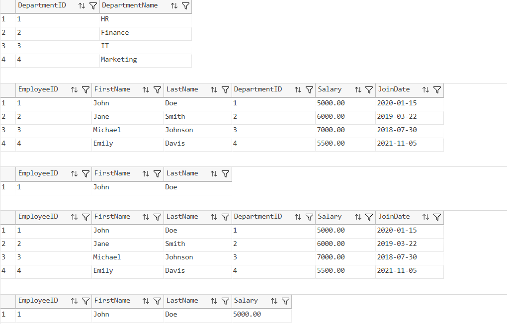

---

### Exercise 2 - Modify Stored Procedure

Procedure Modified:

```sql
sp_GetEmployeesByDepartment
```

Changes:

- Added Salary column to the output

Output Screenshot:

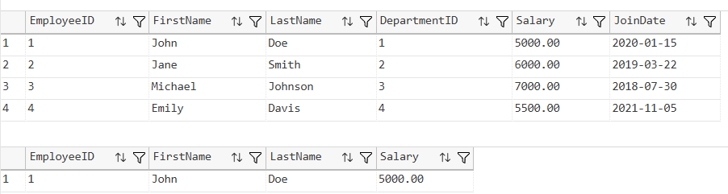

---

### Exercise 3 - Insert Employee Procedure

Procedure Created:

```sql
sp_InsertEmployee
```

Purpose:

- Insert a new employee record using parameters

Output Screenshot:

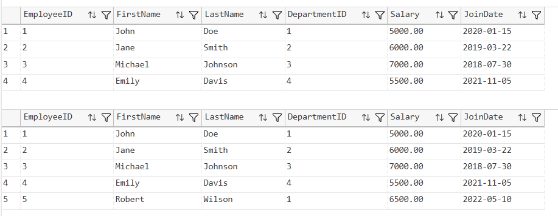

---

### Exercise 4 - Execute Stored Procedure

Procedure Executed:

```sql
EXEC sp_GetEmployeesByDepartment 1
```

Purpose:

- Demonstrate procedure execution

Output Screenshot:

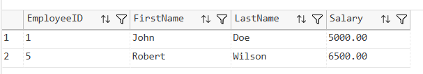

---

### Exercise 5 - Return Employee Count

Procedure Created:

```sql
sp_GetEmployeeCountByDepartment
```

Purpose:

- Return the total number of employees in a department

Output Screenshot:

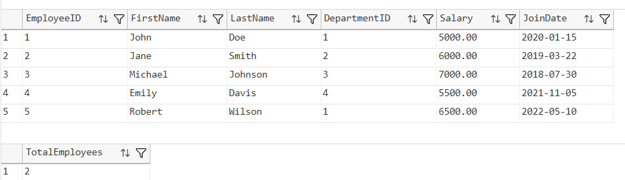

---

### Exercise 6 - Output Parameters

Procedure Created:

```sql
sp_GetDepartmentSalary
```

Purpose:

- Calculate total department salary
- Return value through OUTPUT parameter

Output Screenshot:

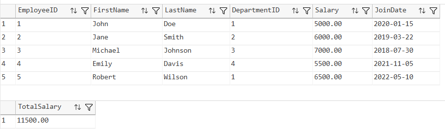

---

### Exercise 7 - Multiple Parameters

Procedure Created:

```sql
sp_UpdateEmployeeSalary
```

Purpose:

- Update employee salary using EmployeeID and NewSalary

Output Screenshot:

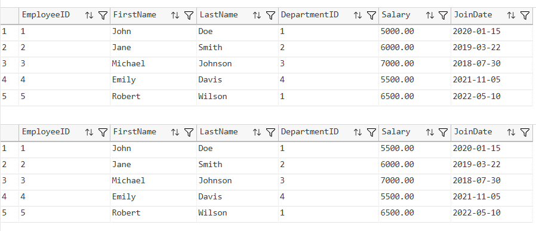

---

### Exercise 8 - Conditional Logic

Procedure Created:

```sql
sp_GiveBonus
```

Purpose:

- Add bonus amount to employees belonging to a department

Output Screenshot:

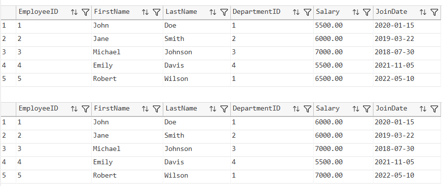

---

### Exercise 9 - Transactions

Procedure Created:

```sql
sp_UpdateSalaryTransaction
```

Purpose:

- Update salary using a transaction
- Ensure data integrity

Output Screenshot:

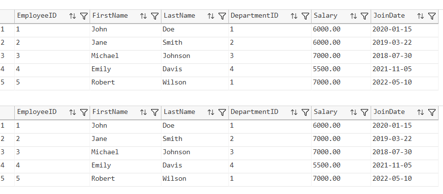

---

### Exercise 10 - Dynamic SQL

Procedure Created:

```sql
sp_GetEmployeesDynamic
```

Purpose:

- Retrieve employee records dynamically using flexible filters

Output Screenshot:


---

### Exercise 11 - Error Handling

Procedure Created:

```sql
sp_UpdateSalaryWithErrorHandling
```

Purpose:

- Handle exceptions using TRY...CATCH
- Return custom status messages

Output Screenshot:

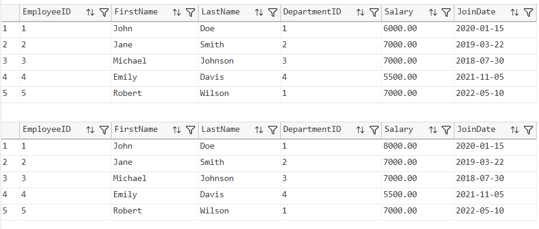

---

## Verification

### Stored Procedures Created

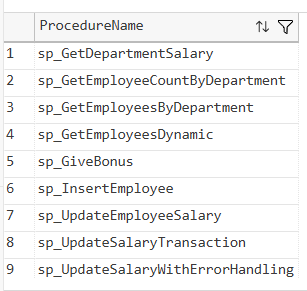

---

### Final Employee Table

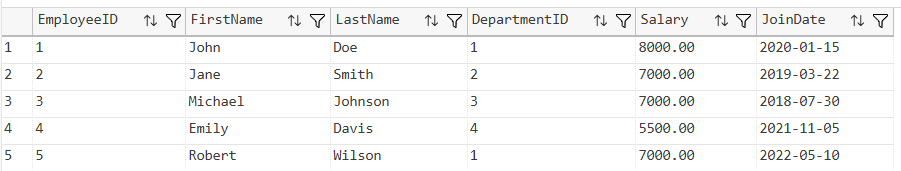

---

## Stored Procedures Created

| Procedure Name | Purpose |
|----------------|----------|
| sp_GetEmployeesByDepartment | Retrieve employees by department |
| sp_InsertEmployee | Insert employee records |
| sp_GetEmployeeCountByDepartment | Count employees in department |
| sp_GetDepartmentSalary | Return total department salary |
| sp_UpdateEmployeeSalary | Update employee salary |
| sp_GiveBonus | Apply department bonus |
| sp_UpdateSalaryTransaction | Salary update using transaction |
| sp_GetEmployeesDynamic | Dynamic SQL filtering |
| sp_UpdateSalaryWithErrorHandling | Error handling example |

---

## Project Structure

```text
1.AdvancedSQLserver
│
└── 4.SQLExercise-StoredProcedures
    │
    ├── Queries.sql
    │
    ├── Output
    │   ├── getemployeesbydepartment.png
    │   ├── modifiedprocedure.png
    │   ├── insertemployee.png
    │   ├── executeprocedure.png
    │   ├── employeecount.png
    │   ├── outputparameter.png
    │   ├── updatesalary.png
    │   ├── givebonus.png
    │   ├── transactionprocedure.png
    │   ├── dynamicsql.png
    │   ├── errorhandling.png
    │   ├── verifyprocedures.png
    │   └── finalemployees.png
    │
    └── README.md
```

---

## How to Run

```text
Server Name: localhost\SQLEXPRESS
Authentication: Windows Authentication
```

Open:

```text
1.AdvancedSQLserver/4.SQLExercise-StoredProcedures/Queries.sql
```

Execute the script using:

- SQL Server Management Studio (SSMS)
- Azure Data Studio
- Visual Studio Code with SQL Server Extension

---

## Files Included

| File | Description |
|------|-------------|
| Queries.sql | Complete SQL implementation |
| README.md | Documentation |
| Output Folder | Stored Procedure output screenshots |

---

## Learning Outcomes

After completing this exercise, the following concepts were demonstrated:

- Stored Procedures
- Procedure Modification
- Input Parameters
- Output Parameters
- Aggregate Functions
- Conditional Logic
- Transactions
- Dynamic SQL
- Error Handling
- SQL Server Procedure Management

---