# SQL Exercise - Functions

## Developer Info
- **Name**: Nirnay Ghosh
- **Assignment**: Cognizant Digital Nurture 5.0
- **Skill**: SQL Server Functions

---

## Problem Statement

Functions in SQL Server allow reusable logic to be encapsulated and executed whenever required. They improve maintainability, reduce redundancy, and simplify calculations.

This exercise demonstrates:

- Scalar Functions
- Table-Valued Functions
- User Defined Functions
- Nested Functions
- Function Modification
- Function Deletion

---

## Objectives

- Create Scalar Functions
- Create Table-Valued Functions
- Create User Defined Functions
- Modify Existing Functions
- Delete Functions
- Execute Functions
- Create Nested Functions
- Verify Function Outputs

---

## Database Schema

### Tables Used

- Departments
- Employees

### Relationships

- One Department can have multiple Employees
- Each Employee belongs to one Department

---

## Sample Data

### Departments

| DepartmentID | DepartmentName |
|-------------|----------------|
| 1 | HR |
| 2 | IT |
| 3 | Finance |

### Employees

| EmployeeID | FirstName | LastName | DepartmentID | Salary | JoinDate |
|------------|-----------|----------|--------------|---------|------------|
| 1 | John | Doe | 1 | 5000.00 | 2020-01-15 |
| 2 | Jane | Smith | 2 | 6000.00 | 2019-03-22 |
| 3 | Bob | Johnson | 3 | 5500.00 | 2021-07-01 |

---

## Exercises Implemented

### Exercise 1 - Scalar Function

Function Created:

```sql
fn_CalculateAnnualSalary
```

Purpose:

- Calculate annual salary
- Formula: Salary × 12

Output Screenshot:

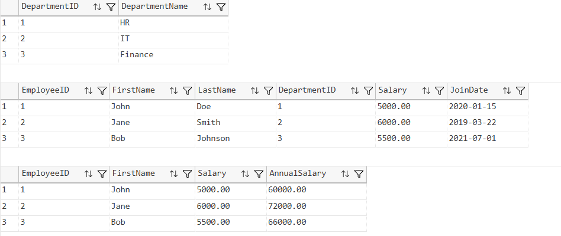

---

### Exercise 2 - Table-Valued Function

Function Created:

```sql
fn_GetEmployeesByDepartment
```

Purpose:

- Return employees belonging to a specific department
- Accept DepartmentID as input

Output Screenshot:

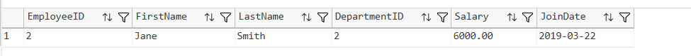

---

### Exercise 3 - User Defined Function

Function Created:

```sql
fn_CalculateBonus
```

Purpose:

- Calculate employee bonus
- Formula: Salary × 10%

Output Screenshot:

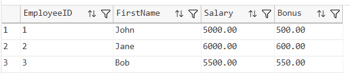

---

### Exercise 4 - Modify User Defined Function

Function Modified:

```sql
fn_CalculateBonus
```

Changes:

- Bonus percentage changed from 10% to 15%

Output Screenshot:

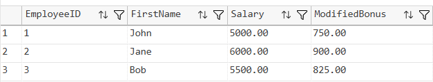

---

### Exercise 5 - Delete Function

Function Deleted:

```sql
fn_CalculateBonus
```

Purpose:

- Demonstrate function deletion

Output Screenshot:

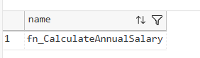

---

### Exercise 6 - Execute Scalar Function

Function Executed:

```sql
fn_CalculateAnnualSalary
```

Purpose:

- Calculate annual salary for all employees

Output Screenshot:

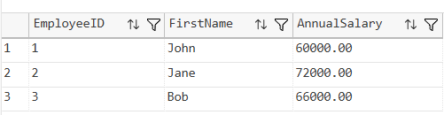

---

### Exercise 7 - Return Data from Scalar Function

Function Executed:

```sql
fn_CalculateAnnualSalary
```

Purpose:

- Calculate annual salary for EmployeeID = 1

Output Screenshot:

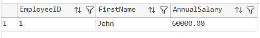

---

### Exercise 8 - Return Data from Table-Valued Function

Function Executed:

```sql
fn_GetEmployeesByDepartment
```

Purpose:

- Return employees belonging to Finance Department

Output Screenshot:

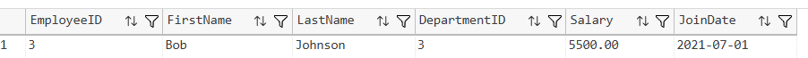

---

### Exercise 9 - Nested User Defined Function

Function Created:

```sql
fn_CalculateTotalCompensation
```

Purpose:

- Combine Annual Salary and Bonus
- Demonstrate nested function calls

Output Screenshot:

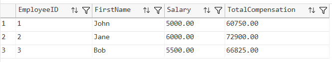

---

### Exercise 10 - Modify Nested Function

Function Modified:

```sql
fn_CalculateTotalCompensation
```

Purpose:

- Update total compensation calculation
- Use modified bonus calculation

Output Screenshot:

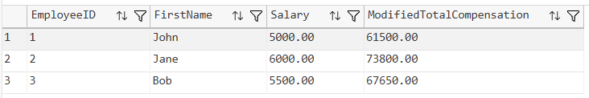

---

## Verification

### Functions Created

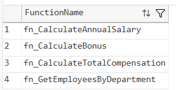

---

### Final Employee Table

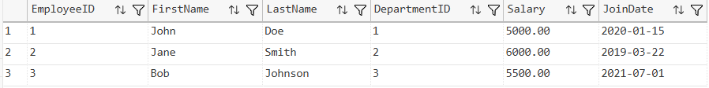

---

## Functions Created

| Function Name | Type | Purpose |
|--------------|------|----------|
| fn_CalculateAnnualSalary | Scalar Function | Calculate annual salary |
| fn_GetEmployeesByDepartment | Table-Valued Function | Return employees by department |
| fn_CalculateBonus | User Defined Function | Calculate employee bonus |
| fn_CalculateTotalCompensation | Nested Function | Calculate total compensation |

---

## Project Structure

```text
1.AdvancedSQLserver
│
└── 5.SQLExercise-Functions
    │
    ├── Queries.sql
    │
    ├── Output
    │   ├── annualsalaryfunction.png
    │   ├── departmentfunction.png
    │   ├── bonusfunction.png
    │   ├── modifiedbonusfunction.png
    │   ├── deletedfunction.png
    │   ├── executescalarfunction.png
    │   ├── annualsalaryemployee1.png
    │   ├── financedepartmentfunction.png
    │   ├── totalcompensation.png
    │   ├── modifiedtotalcompensation.png
    │   ├── verifyfunctions.png
    │   └── finalemployees.png
    │
    └── README.md
```

---

## How to Run

```text
Server Name: localhost\SQLEXPRESS
Authentication: Windows Authentication
```

Open:

```text
1.AdvancedSQLserver/5.SQLExercise-Functions/Queries.sql
```

Execute the script using:

- SQL Server Management Studio (SSMS)
- Azure Data Studio
- Visual Studio Code with SQL Server Extension

---

## Files Included

| File | Description |
|------|-------------|
| Queries.sql | Complete SQL implementation |
| README.md | Documentation |
| Output Folder | Function output screenshots |

---

## Learning Outcomes

After completing this exercise, the following concepts were demonstrated:

- Scalar Functions
- Table-Valued Functions
- User Defined Functions
- Nested Functions
- Function Modification
- Function Deletion
- Function Execution
- SQL Server Function Management
- Reusable Database Logic

---