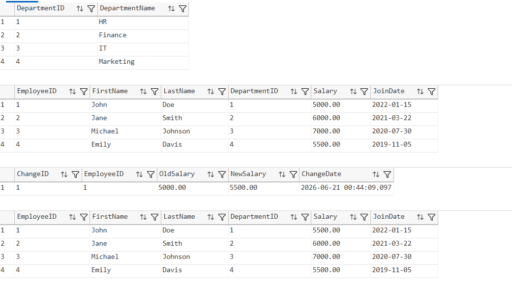
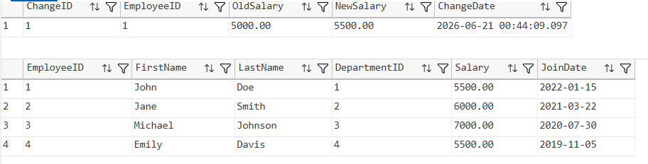
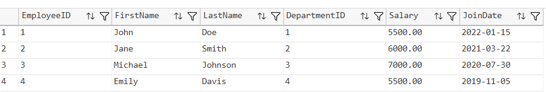
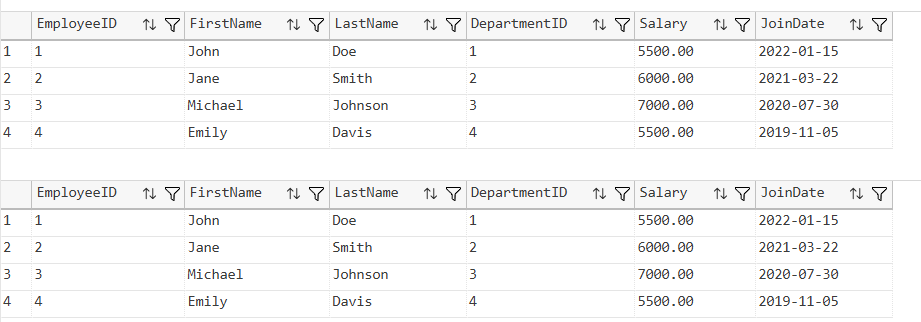
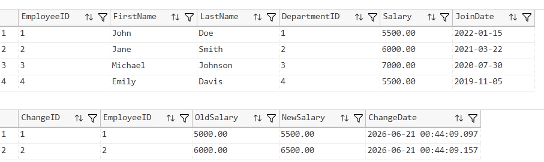
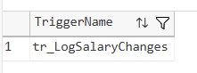
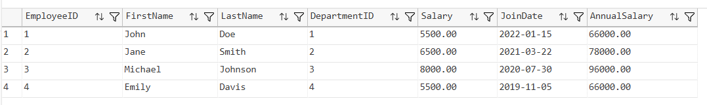
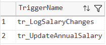
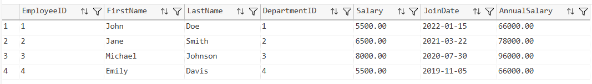
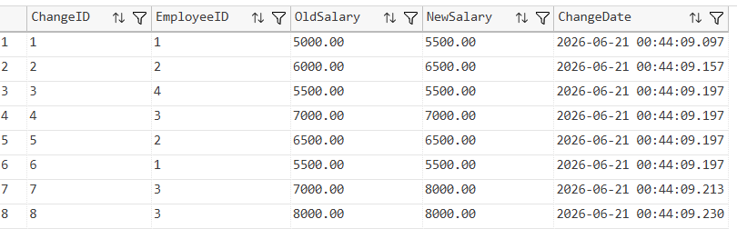

# SQL Exercise - Triggers

## Developer Info
- **Name**: Nirnay Ghosh
- **Assignment**: Cognizant Digital Nurture 5.0
- **Skill**: SQL Server Triggers

---

## Problem Statement

Triggers are special stored procedures that automatically execute in response to specific database events such as INSERT, UPDATE, DELETE, and LOGON operations.

This exercise demonstrates the creation, modification, execution, and deletion of various SQL Server triggers.

---

## Objectives

- Create AFTER Triggers
- Create INSTEAD OF Triggers
- Understand LOGON Triggers
- Modify Existing Triggers
- Delete Triggers
- Maintain Audit Logs using Triggers
- Automatically Update Computed Columns

---

## Database Schema

### Tables Used

- Departments
- Employees
- EmployeeChanges

### Relationships

- One Department can have multiple Employees
- Each Employee belongs to one Department
- EmployeeChanges stores salary modification history

---

## Sample Data

### Departments

| DepartmentID | DepartmentName |
|-------------|----------------|
| 1 | HR |
| 2 | Finance |
| 3 | IT |
| 4 | Marketing |

### Employees

| EmployeeID | FirstName | LastName | DepartmentID | Salary | JoinDate |
|------------|-----------|----------|--------------|---------|------------|
| 1 | John | Doe | 1 | 5000.00 | 2022-01-15 |
| 2 | Jane | Smith | 2 | 6000.00 | 2021-03-22 |
| 3 | Michael | Johnson | 3 | 7000.00 | 2020-07-30 |
| 4 | Emily | Davis | 4 | 5500.00 | 2019-11-05 |

---

## Exercises Implemented

### Exercise 1 - Create an AFTER Trigger

Trigger Created:

```sql
tr_LogSalaryChanges
```

Purpose:

- Track salary updates
- Store old and new salary values in EmployeeChanges table

Output Screenshots:





---

### Exercise 2 - Create an INSTEAD OF Trigger

Trigger Created:

```sql
tr_PreventEmployeeDelete
```

Purpose:

- Prevent employee records from being deleted
- Display custom error message

Output Screenshot:



---

### Exercise 3 - Create a LOGON Trigger

Trigger Demonstrated:

```sql
tr_RestrictLogin
```

Purpose:

- Restrict logins during maintenance hours
- Demonstrated as SQL code because server-level permissions are required

Output Screenshot:



---

### Exercise 4 - Modify an Existing Trigger

Trigger Modified:

```sql
tr_LogSalaryChanges
```

Changes:

- Updated trigger logic
- Verified salary change logging

Output Screenshot:



---

### Exercise 5 - Delete a Trigger

Trigger Deleted:

```sql
tr_PreventEmployeeDelete
```

Purpose:

- Demonstrate trigger deletion
- Verify remaining triggers

Output Screenshot:



---

### Exercise 6 - Trigger to Update Computed Column

Trigger Created:

```sql
tr_UpdateAnnualSalary
```

Purpose:

- Automatically update AnnualSalary whenever Salary changes
- Maintain data consistency

Formula:

```sql
AnnualSalary = Salary * 12
```

Output Screenshot:



---

## Verification

### Triggers Present in Database

Output Screenshot:



---

### Final Employees Table

Output Screenshot:



---

### Employee Changes Audit Table

Output Screenshot:



---

## Triggers Created

| Trigger Name | Type | Purpose |
|-------------|------|----------|
| tr_LogSalaryChanges | AFTER UPDATE | Log salary modifications |
| tr_PreventEmployeeDelete | INSTEAD OF DELETE | Prevent employee deletion |
| tr_RestrictLogin | LOGON | Restrict logins during maintenance |
| tr_UpdateAnnualSalary | AFTER UPDATE | Update AnnualSalary automatically |

---

## Project Structure

```text
1.AdvancedSQLserver
│
└── 6.SQLExercise-Triggers
    │
    ├── Queries.sql
    │
    ├── Output
    │   ├── aftertrigger.png
    │   ├── employeechangeslog.png
    │   ├── insteadoftrigger.png
    │   ├── logintriggerdemo.png
    │   ├── modifiedtrigger.png
    │   ├── deletedtrigger.png
    │   ├── annualsalarytrigger.png
    │   ├── verifytriggers.png
    │   ├── finalemployees.png
    │   └── finalemployeechanges.png
    │
    └── README.md
```

---

## How to Run

```text
Server Name: localhost\SQLEXPRESS
Authentication: Windows Authentication
```

Open:

```text
1.AdvancedSQLserver/6.SQLExercise-Triggers/Queries.sql
```

Execute the script using:

- SQL Server Management Studio (SSMS)
- Azure Data Studio
- Visual Studio Code with SQL Server Extension

---

## Files Included

| File | Description |
|------|-------------|
| Queries.sql | Complete SQL implementation |
| README.md | Documentation |
| Output Folder | Trigger output screenshots |

---

## Learning Outcomes

After completing this exercise, the following concepts were demonstrated:

- AFTER Triggers
- INSTEAD OF Triggers
- LOGON Triggers
- Trigger Modification
- Trigger Deletion
- Audit Logging
- Automatic Data Maintenance
- Computed Column Updates
- SQL Server Trigger Management

---