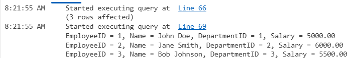
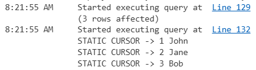
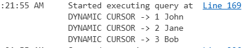
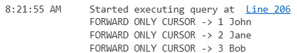
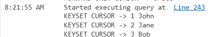
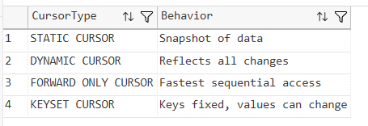
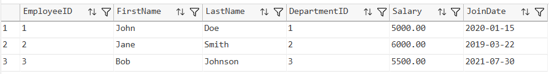

# SQL Exercise - Cursors

## Developer Info
- **Name**: Nirnay Ghosh
- **Assignment**: Cognizant Digital Nurture 5.0
- **Skill**: SQL Server Cursors

---

## Problem Statement

Cursors in SQL Server allow row-by-row processing of query results. Although set-based operations are generally preferred, cursors are useful when sequential processing of records is required.

This exercise demonstrates:

- Creating and using cursors
- Iterating through records
- Different cursor types in SQL Server
- Comparing cursor behavior

---

## Objectives

- Create a Cursor
- Fetch Records Sequentially
- Print Employee Details
- Understand Static Cursors
- Understand Dynamic Cursors
- Understand Forward-Only Cursors
- Understand Keyset Cursors
- Compare Cursor Types

---

## Database Schema

### Tables Used

- Departments
- Employees

### Relationships

- One Department can have multiple Employees
- Each Employee belongs to one Department

---

## Sample Data

### Departments

| DepartmentID | DepartmentName |
|-------------|----------------|
| 1 | HR |
| 2 | IT |
| 3 | Finance |

### Employees

| EmployeeID | FirstName | LastName | DepartmentID | Salary | JoinDate |
|------------|-----------|----------|--------------|---------|------------|
| 1 | John | Doe | 1 | 5000.00 | 2020-01-15 |
| 2 | Jane | Smith | 2 | 6000.00 | 2019-03-22 |
| 3 | Bob | Johnson | 3 | 5500.00 | 2021-07-30 |

---

## Exercises Implemented

### Exercise 1 - Create a Cursor

Cursor Created:

```sql
EmployeeCursor
```

Purpose:

- Iterate through all employee records
- Fetch one row at a time
- Display employee details using PRINT statements

Operations Performed:

- DECLARE Cursor
- OPEN Cursor
- FETCH Records
- Process Records
- CLOSE Cursor
- DEALLOCATE Cursor

Output Screenshot:



---

### Exercise 2A - Static Cursor

Cursor Type:

```sql
STATIC CURSOR
```

Purpose:

- Creates a snapshot of the result set
- Does not reflect changes made after opening

Output Screenshot:



---

### Exercise 2B - Dynamic Cursor

Cursor Type:

```sql
DYNAMIC CURSOR
```

Purpose:

- Reflects all data changes while cursor is open
- Most flexible cursor type

Output Screenshot:



---

### Exercise 2C - Forward-Only Cursor

Cursor Type:

```sql
FORWARD_ONLY CURSOR
```

Purpose:

- Moves only forward through records
- Fastest and most efficient cursor type

Output Screenshot:



---

### Exercise 2D - Keyset Cursor

Cursor Type:

```sql
KEYSET CURSOR
```

Purpose:

- Stores key values when opened
- Reflects updates but not newly inserted rows

Output Screenshot:



---

## Cursor Comparison

The behavior of various cursor types was compared.

| Cursor Type | Behavior |
|------------|----------|
| Static | Snapshot of data |
| Dynamic | Reflects all changes |
| Forward Only | Fast sequential access |
| Keyset | Fixed keys, updated values |

Output Screenshot:



---

## Verification

### Final Employees Table

Output Screenshot:



---

## Cursor Types Demonstrated

| Cursor Type | Purpose |
|------------|----------|
| EmployeeCursor | Basic cursor implementation |
| Static Cursor | Snapshot-based cursor |
| Dynamic Cursor | Reflects runtime changes |
| Forward-Only Cursor | Sequential processing |
| Keyset Cursor | Key-based cursor processing |

---

## Project Structure

```text
1.AdvancedSQLserver
│
└── 7.SQLExercise-Cursors
    │
    ├── Queries.sql
    │
    ├── Output
    │   ├── createcursor.png
    │   ├── staticcursor.png
    │   ├── dynamiccursor.png
    │   ├── forwardonlycursor.png
    │   ├── keysetcursor.png
    │   ├── cursorcomparison.png
    │   └── finalemployees.png
    │
    └── README.md
```

---

## How to Run

```text
Server Name: localhost\SQLEXPRESS
Authentication: Windows Authentication
```

Open:

```text
1.AdvancedSQLserver/7.SQLExercise-Cursors/Queries.sql
```

Execute the script using:

- SQL Server Management Studio (SSMS)
- Azure Data Studio
- Visual Studio Code with SQL Server Extension

---

## Files Included

| File | Description |
|------|-------------|
| Queries.sql | Complete SQL implementation |
| README.md | Documentation |
| Output Folder | Cursor output screenshots |

---

## Learning Outcomes

After completing this exercise, the following concepts were demonstrated:

- Cursor Creation
- Cursor Navigation
- FETCH Operations
- OPEN and CLOSE Cursor Operations
- DEALLOCATE Cursor
- Static Cursor
- Dynamic Cursor
- Forward-Only Cursor
- Keyset Cursor
- Cursor Performance Characteristics

---