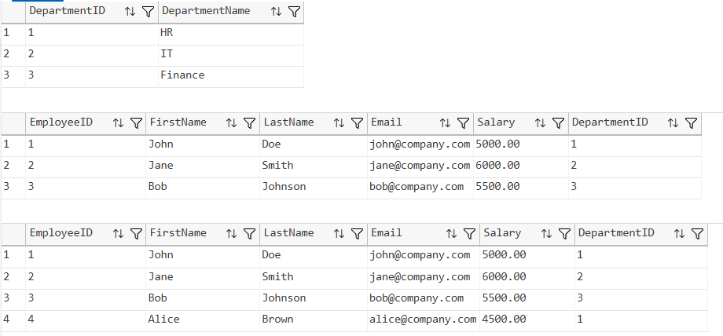
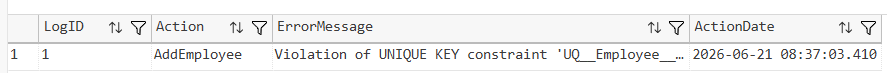
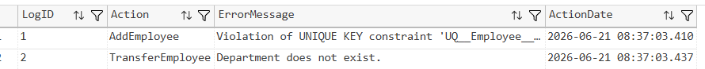
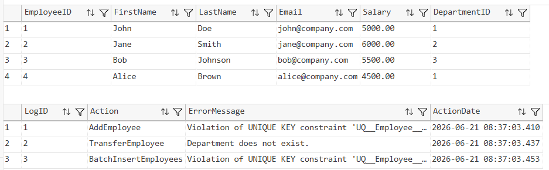
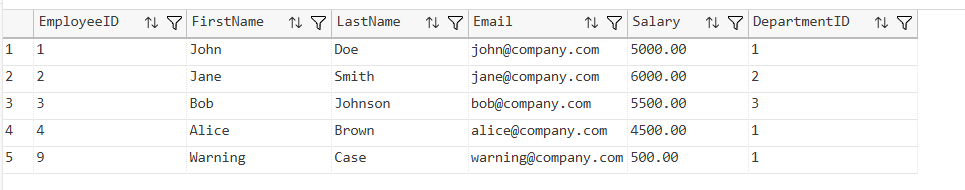
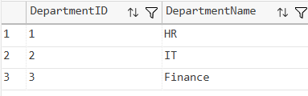
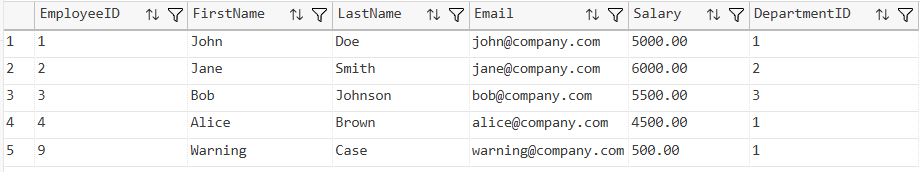
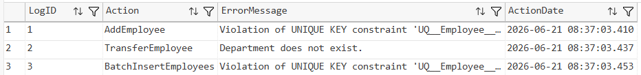

# SQL Exercise - Exception Handling

## Developer Info
- **Name**: Nirnay Ghosh
- **Assignment**: Cognizant Digital Nurture 5.0
- **Skill**: SQL Server Exception Handling

---

## Problem Statement

Exception handling is an essential part of database programming that helps manage runtime errors, maintain data integrity, and provide meaningful error messages to users and applications.

This exercise demonstrates the use of:

- TRY...CATCH
- THROW
- RAISERROR
- Transactions
- Error Logging
- Nested Exception Handling

---

## Objectives

- Implement TRY...CATCH blocks
- Log errors into an audit table
- Re-throw exceptions using THROW
- Create custom errors using RAISERROR
- Use nested exception handling
- Combine transactions with exception handling
- Understand severity levels in RAISERROR

---

## Database Schema

### Departments

| Column | Data Type | Description |
|----------|----------|-------------|
| DepartmentID | INT (PK) | Unique department ID |
| DepartmentName | VARCHAR(100) | Department name |

### Employees

| Column | Data Type | Description |
|----------|----------|-------------|
| EmployeeID | INT (PK) | Unique employee ID |
| FirstName | VARCHAR(50) | Employee first name |
| LastName | VARCHAR(50) | Employee last name |
| Email | VARCHAR(100) | Unique employee email |
| Salary | DECIMAL(10,2) | Employee salary |
| DepartmentID | INT (FK) | Linked department |

### AuditLog

| Column | Data Type | Description |
|----------|----------|-------------|
| LogID | INT IDENTITY | Log identifier |
| Action | VARCHAR(100) | Procedure name |
| ErrorMessage | VARCHAR(4000) | Error description |
| ActionDate | DATETIME | Timestamp |

---

## Sample Data

### Departments

| DepartmentID | DepartmentName |
|-------------|----------------|
| 1 | HR |
| 2 | IT |
| 3 | Finance |

### Employees

| EmployeeID | FirstName | LastName | Email |
|------------|-----------|----------|--------|
| 1 | John | Doe | john@company.com |
| 2 | Jane | Smith | jane@company.com |
| 3 | Bob | Johnson | bob@company.com |

---

## Exercises Implemented

### Question 1 - Basic TRY...CATCH for Error Logging

Stored Procedure:

```sql
AddEmployee
```

Features:

- Inserts employee records
- Uses TRY...CATCH
- Logs errors into AuditLog

Output Screenshot:



---

### Question 2 - Using THROW to Re-Raise Errors

Procedure Modified:

```sql
AddEmployee
```

Features:

- Logs errors into AuditLog
- Uses THROW to propagate the error

Output Screenshot:



---

### Question 3 - Custom Error with RAISERROR

Validation:

```sql
Salary > 0
```

Custom Error:

```sql
Salary must be greater than zero.
```

Features:

- Business rule enforcement
- Custom validation error

Output Screenshot:


---

### Question 4 - Nested TRY...CATCH with RAISERROR

Stored Procedure:

```sql
TransferEmployee
```

Features:

- Nested TRY...CATCH blocks
- Department existence validation
- Error logging
- Error propagation

Output Screenshot:



---

### Question 5 - Logging All Errors in a Transaction

Stored Procedure:

```sql
BatchInsertEmployees
```

Features:

- Multiple inserts
- Transaction management
- Automatic rollback on failure
- Error logging

Output Screenshot:



---

### Question 6 - Dynamic RAISERROR with Severity and State

Procedure Modified:

```sql
AddEmployee
```

Conditions:

| Condition | Severity |
|------------|-----------|
| Salary < 1000 | 10 (Warning) |
| Salary < 0 | 16 (Error) |

Features:

- Dynamic error handling
- Different severity levels

Output Screenshot:



---

## Verification Outputs

### Departments Table

Output Screenshot:



---

### Employees Table

Output Screenshot:



---

### Audit Log Table

Output Screenshot:



---

## Stored Procedures Created

| Procedure | Purpose |
|------------|----------|
| AddEmployee | Insert employee with validations |
| TransferEmployee | Transfer employee between departments |
| BatchInsertEmployees | Demonstrate transactions and rollback |

---

## Exception Handling Techniques Demonstrated

| Technique | Purpose |
|------------|----------|
| TRY...CATCH | Catch runtime errors |
| THROW | Re-raise exceptions |
| RAISERROR | Custom business errors |
| Nested TRY...CATCH | Multi-level error handling |
| Transactions | Ensure data consistency |
| Audit Logging | Persist error information |

---

## Project Structure

```text
1.AdvancedSQLserver
│
└── 8.SQLExercise-ExceptionHandling
    │
    ├── Queries.sql
    │
    ├── Output
    │   ├── addemployee_success.png
    │   ├── throw_error.png
    │   ├── raiserror_salary.png
    │   ├── transferemployee_error.png
    │   ├── batchinsert_transaction.png
    │   ├── severity_warning.png
    │   ├── departments.png
    │   ├── employees.png
    │   └── auditlog.png
    │
    └── README.md
```

---

## How to Run

```text
Server Name: localhost\SQLEXPRESS
Authentication: Windows Authentication
```

Open:

```text
1.AdvancedSQLserver/8.SQLExercise-ExceptionHandling/Queries.sql
```

Execute using:

- SQL Server Management Studio (SSMS)
- Azure Data Studio
- Visual Studio Code with SQL Server Extension

---

## Files Included

| File | Description |
|--------|-------------|
| Queries.sql | Complete SQL implementation |
| README.md | Documentation |
| Output Folder | Screenshots of execution results |

---

## Learning Outcomes

After completing this exercise, the following concepts were demonstrated:

- TRY...CATCH Blocks
- Error Logging
- THROW Statement
- RAISERROR Statement
- Custom Business Rule Validation
- Nested Exception Handling
- Transaction Rollback
- Severity Levels
- SQL Server Error Management
- Audit Logging Mechanism

---