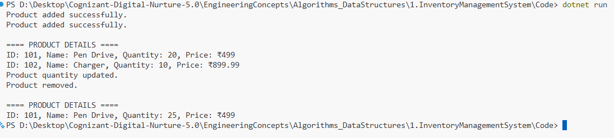

# Exercise 1: Inventory Management System (C#)

## ✅ Objective
Build an inventory management system to add, update, delete and display products efficiently using appropriate data structures.

## 👨‍💻 Submitted by
**Nirnay Ghosh**  
**Cognizant Digital Nurture 5.0**

## 🧠 Concepts Used
- Data Structures: `Dictionary<int, Product>` for fast lookups.
- Time Complexity:
  - Add: O(1)
  - Update: O(1)
  - Delete: O(1)

## 💻 Features Implemented
- Add product
- Update quantity
- Delete product
- Display all products

## 📸 Output Screenshot


## How to Run

```bash
cd Algorithms_DataStructures/1.InventoryManagementSystem/Code
dotnet run