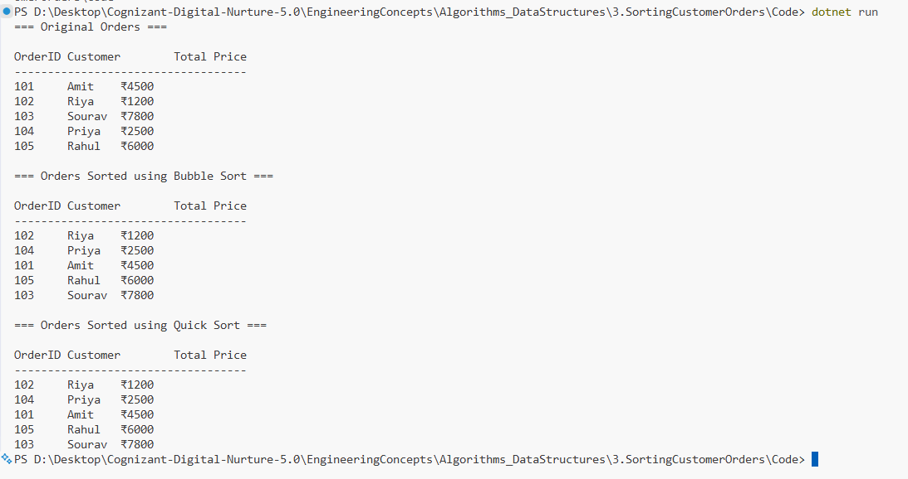

# Exercise 3: Sorting Customer Orders

## 👨‍💻 Developer Info
- **Name**: Nirnay Ghosh
- **Assignment**: Cognizant Digital Nurture 5.0
- **Skill**: Data Structures and Algorithms

---

## 🧠 Problem Statement

You are tasked with sorting customer orders by their total price on an e-commerce platform.

Sorting helps prioritize high-value orders and improves order management efficiency.

---

## ✅ Objectives

- Understand different sorting algorithms.
- Implement Bubble Sort for customer orders.
- Implement Quick Sort for customer orders.
- Compare the performance of both algorithms.
- Analyze their time complexities.

---

## 📚 Sorting Algorithms Overview

### Bubble Sort
- Repeatedly compares adjacent elements.
- Swaps them if they are in the wrong order.
- Simple but inefficient for large datasets.

### Insertion Sort
- Builds a sorted portion one element at a time.
- Efficient for small or nearly sorted datasets.

### Quick Sort
- Uses Divide and Conquer strategy.
- Selects a pivot and partitions the array.
- Much faster for large datasets.

### Merge Sort
- Divides the array into halves.
- Recursively sorts and merges them.
- Guaranteed O(n log n) performance.

---

## 🏗️ Implementation Details

### 👨‍🔧 Class Used

#### Order
Contains:
- OrderId
- CustomerName
- TotalPrice

### Sorting Methods

- `BubbleSort(Order[] orders)`
- `QuickSort(Order[] orders, int low, int high)`
- `Partition(Order[] orders, int low, int high)`

---

## 📈 Sample Data

| Order ID | Customer | Total Price |
|-----------|-----------|-------------|
| 101 | Amit | 4500 |
| 102 | Riya | 1200 |
| 103 | Sourav | 7800 |
| 104 | Priya | 2500 |
| 105 | Rahul | 6000 |

---

## 📊 Time Complexities

| Algorithm | Best Case | Average Case | Worst Case |
|------------|------------|------------|------------|
| Bubble Sort | O(n) | O(n²) | O(n²) |
| Quick Sort | O(n log n) | O(n log n) | O(n²) |

---

## 🔍 Performance Comparison

### Bubble Sort
- Easy to understand and implement.
- Performs many unnecessary comparisons.
- Not suitable for large datasets.

### Quick Sort
- Uses divide-and-conquer approach.
- Faster in practical applications.
- Requires less memory than Merge Sort.
- Preferred for large collections of records.

---

## 🚀 Why Quick Sort is Preferred

- Average complexity is O(n log n).
- Handles large datasets efficiently.
- Widely used in real-world applications.
- Significantly faster than Bubble Sort for large numbers of orders.

---

## 📸 Output Screenshot

Below is the sample run showing Bubble Sort and Quick Sort results:



---

## 🛠️ How to Run

```bash
cd Algorithms_DataStructures/3.SortingCustomerOrders/Code
dotnet run
```

---

## 🎯 Expected Output

```
=== Original Orders ===

101  Amit    4500
102  Riya    1200
103  Sourav  7800
104  Priya   2500
105  Rahul   6000

=== Orders Sorted using Bubble Sort ===

102  Riya    1200
104  Priya   2500
101  Amit    4500
105  Rahul   6000
103  Sourav  7800

=== Orders Sorted using Quick Sort ===

102  Riya    1200
104  Priya   2500
101  Amit    4500
105  Rahul   6000
103  Sourav  7800
```