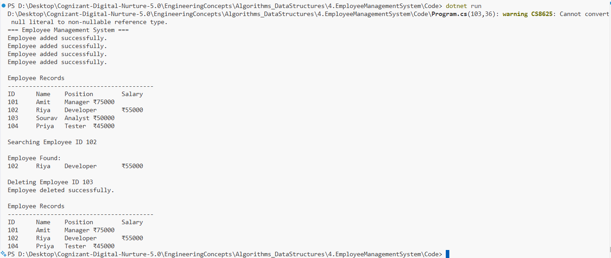

# Exercise 4: Employee Management System

## 👨‍💻 Developer Info
- **Name**: Nirnay Ghosh
- **Assignment**: Cognizant Digital Nurture 5.0
- **Skill**: Data Structures and Algorithms

---

## 🧠 Problem Statement

You are developing an Employee Management System for a company.

Employee information must be stored efficiently and support operations such as adding, searching, traversing, and deleting employee records.

---

## ✅ Objectives

- Understand array representation in memory.
- Store employee records using arrays.
- Implement add, search, traverse, and delete operations.
- Analyze time complexity of array operations.
- Understand advantages and limitations of arrays.

---

## 📚 Array Representation in Memory

Arrays store elements in **contiguous memory locations**.

Example:

```

Index:  0    1    2    3
Value:  A    B    C    D

```

Memory Layout:

```

| A | B | C | D |

```

Because memory locations are contiguous, elements can be accessed directly using their index.

### Advantages of Arrays

- Fast access using index.
- Simple implementation.
- Efficient memory utilization.
- Suitable when size is known beforehand.

---

## 🏗️ Implementation Details

### 👨‍🔧 Class Used

#### Employee

Attributes:

- EmployeeId
- Name
- Position
- Salary

---

### Operations Implemented

#### Add Employee
Adds a new employee record into the array.

```csharp
AddEmployee(Employee employee);
```

#### Search Employee
Searches employee by Employee ID.

```csharp
SearchEmployee(int employeeId);
```

#### Traverse Employees
Displays all employee records.

```csharp
TraverseEmployees();
```

#### Delete Employee
Removes an employee and shifts remaining elements.

```csharp
DeleteEmployee(int employeeId);
```

---

## 📈 Sample Data

| Employee ID | Name | Position | Salary |
|------------|------|----------|---------|
| 101 | Amit | Manager | 75000 |
| 102 | Riya | Developer | 55000 |
| 103 | Sourav | Analyst | 50000 |
| 104 | Priya | Tester | 45000 |

---

## 📊 Time Complexity Analysis

| Operation | Time Complexity | Reason |
|------------|----------------|---------|
| Add | O(1) | Insert at next available position |
| Search | O(n) | Linear search through array |
| Traverse | O(n) | Visit every employee |
| Delete | O(n) | Search + shifting elements |

---

## 🔍 Limitations of Arrays

- Fixed size once created.
- Insertion in the middle is costly.
- Deletion requires shifting elements.
- Memory may be wasted if array size is larger than needed.
- Cannot dynamically grow like collections such as List.

---

## 🚀 When to Use Arrays

Arrays are preferred when:

- Number of elements is known beforehand.
- Fast indexed access is required.
- Memory overhead should be minimal.
- Frequent insertions and deletions are not required.

Examples:
- Student records of fixed size.
- Monthly sales data.
- Sensor readings.
- Fixed inventory systems.

---

## 📸 Output Screenshot

Below is the sample execution of the Employee Management System:



---

## 🛠️ How to Run

```bash
cd Algorithms_DataStructures/4.EmployeeManagementSystem/Code
dotnet run
```

---

## 🎯 Expected Output

```
=== Employee Management System ===

Employee added successfully.
Employee added successfully.
Employee added successfully.
Employee added successfully.

Employee Records

ID      Name    Position        Salary
101     Amit    Manager         75000
102     Riya    Developer       55000
103     Sourav  Analyst         50000
104     Priya   Tester          45000

Searching Employee ID 102

Employee Found:
102     Riya    Developer       55000

Deleting Employee ID 103

Employee deleted successfully.

Employee Records

ID      Name    Position        Salary
101     Amit    Manager         75000
102     Riya    Developer       55000
104     Priya   Tester          45000
```

---

## 🎓 Conclusion

This exercise demonstrates how arrays can be used to manage employee records efficiently. While arrays provide fast access and simple implementation, their fixed size and costly insertion/deletion operations make them less suitable for highly dynamic datasets.