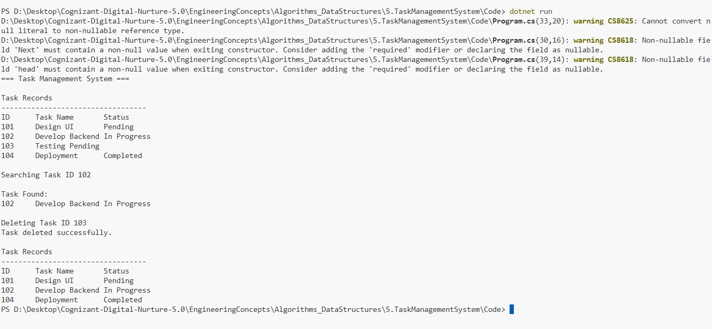

# Exercise 5: Task Management System

## 👨‍💻 Developer Info
- **Name**: Nirnay Ghosh
- **Assignment**: Cognizant Digital Nurture 5.0
- **Skill**: Data Structures and Algorithms

---

## 🧠 Problem Statement

You are developing a Task Management System where tasks need to be added, searched, traversed, and deleted efficiently.

To support dynamic data management, a Singly Linked List is used.

---

## ✅ Objectives

- Understand linked lists and their types.
- Implement a Singly Linked List.
- Perform add, search, traverse, and delete operations.
- Analyze the time complexity of each operation.
- Compare linked lists with arrays.

---

## 📚 Understanding Linked Lists

A Linked List is a linear data structure where elements are connected using pointers (references).

Each node contains:

- Data
- Reference to the next node

---

### Singly Linked List

Each node points only to the next node.

```text
[Data|Next] → [Data|Next] → [Data|Next] → NULL
```

### Doubly Linked List

Each node contains references to both previous and next nodes.

```text
NULL ← [Prev|Data|Next] ⇄ [Prev|Data|Next] ⇄ [Prev|Data|Next] → NULL
```

---

## 🏗️ Implementation Details

### 👨‍🔧 Classes Used

#### Task

Attributes:

- TaskId
- TaskName
- Status

#### Node

Contains:

- Task Data
- Next Reference

#### SinglyLinkedList

Methods:

- AddTask()
- SearchTask()
- TraverseTasks()
- DeleteTask()

---

## 📈 Sample Data

| Task ID | Task Name | Status |
|----------|------------|---------|
| 101 | Design UI | Pending |
| 102 | Develop Backend | In Progress |
| 103 | Testing | Pending |
| 104 | Deployment | Completed |

---

## 📊 Time Complexity Analysis

| Operation | Time Complexity | Reason |
|------------|----------------|---------|
| Add | O(n) | Traverse to last node |
| Search | O(n) | Sequential traversal |
| Traverse | O(n) | Visit all nodes |
| Delete | O(n) | Search then update links |

---

## 🔍 Advantages of Linked Lists Over Arrays

### Dynamic Size
- Linked lists grow and shrink dynamically.
- Arrays have fixed size.

### Efficient Insertions and Deletions
- No shifting of elements required.
- Only pointer updates are needed.

### Better Memory Utilization
- Memory is allocated as needed.

### Flexible Structure
- Suitable when number of records is unknown.

---

## ⚠️ Limitations of Linked Lists

- No direct indexing like arrays.
- More memory required for pointers.
- Traversal is slower compared to indexed access.

---

## 🚀 When to Use Linked Lists

Linked Lists are preferred when:

- Data size changes frequently.
- Frequent insertions and deletions occur.
- Dynamic memory allocation is required.

Examples:

- Task management systems
- Browser history
- Music playlists
- Undo/Redo functionality

---

## 📸 Output Screenshot

Below is the sample execution of the Task Management System:



---

## 🛠️ How to Run

```bash
cd Algorithms_DataStructures/5.TaskManagementSystem/Code
dotnet run
```

---

## 🎯 Expected Output

```text
=== Task Management System ===

Task Records

ID      Task Name           Status
101     Design UI           Pending
102     Develop Backend     In Progress
103     Testing             Pending
104     Deployment          Completed

Searching Task ID 102

Task Found:
102     Develop Backend     In Progress

Deleting Task ID 103

Task deleted successfully.

Task Records

ID      Task Name           Status
101     Design UI           Pending
102     Develop Backend     In Progress
104     Deployment          Completed
```

---

## 🎓 Conclusion

This exercise demonstrates the implementation of a Singly Linked List for managing tasks dynamically.

Compared to arrays, linked lists provide greater flexibility for insertion and deletion operations, making them suitable for applications where data changes frequently.