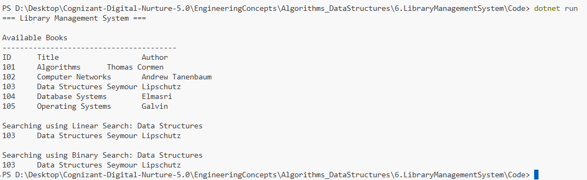

# Exercise 6: Library Management System

## 👨‍💻 Developer Info
- **Name**: Nirnay Ghosh
- **Assignment**: Cognizant Digital Nurture 5.0
- **Skill**: Data Structures and Algorithms

---

## 🧠 Problem Statement

You are developing a Library Management System where users can search for books by title or author.

Efficient searching becomes important as the number of books grows. This exercise demonstrates both Linear Search and Binary Search techniques.

---

## ✅ Objectives

- Understand Linear Search and Binary Search algorithms.
- Create a Book class with necessary attributes.
- Implement Linear Search for book lookup.
- Implement Binary Search for book lookup on sorted data.
- Compare the performance of both search algorithms.

---

## 📚 Understanding Search Algorithms

### Linear Search

Linear Search checks each element one by one until the target is found.

Example:

```text
[Algorithms] [Computer Networks] [Data Structures] [Database Systems]

Search: Data Structures

Step 1 → Algorithms ❌
Step 2 → Computer Networks ❌
Step 3 → Data Structures ✅
```

Characteristics:

- Simple implementation
- No sorting required
- Suitable for small datasets

---

### Binary Search

Binary Search repeatedly divides the search space into halves.

Example:

```text
Sorted Books

Algorithms
Computer Networks
Data Structures
Database Systems
Operating Systems

Search: Data Structures

Middle → Data Structures ✅
```

Characteristics:

- Requires sorted data
- Very efficient for large datasets
- Uses divide-and-conquer approach

---

## 🏗️ Implementation Details

### 👨‍🔧 Class Used

#### Book

Attributes:

- BookId
- Title
- Author

Methods:

- Display()

---

### Search Methods

#### Linear Search

```csharp
LinearSearch(Book[] books, string title)
```

Sequentially checks each book title.

---

#### Binary Search

```csharp
BinarySearch(Book[] books, string title)
```

Repeatedly checks the middle element and narrows the search range.

---

## 📈 Sample Data

| Book ID | Title | Author |
|----------|--------|---------|
| 101 | Algorithms | Thomas Cormen |
| 102 | Computer Networks | Andrew Tanenbaum |
| 103 | Data Structures | Seymour Lipschutz |
| 104 | Database Systems | Elmasri |
| 105 | Operating Systems | Galvin |

---

## 📊 Time Complexity Comparison

| Algorithm | Best Case | Average Case | Worst Case |
|------------|------------|------------|------------|
| Linear Search | O(1) | O(n) | O(n) |
| Binary Search | O(1) | O(log n) | O(log n) |

---

## 🔍 Comparison of Linear Search and Binary Search

### Linear Search

Advantages:

- Works on unsorted data.
- Easy to implement.
- Suitable for small collections.

Disadvantages:

- Slow for large datasets.
- Requires checking many elements.

---

### Binary Search

Advantages:

- Extremely fast on large datasets.
- Reduces search space by half each step.
- Efficient and scalable.

Disadvantages:

- Data must be sorted.
- Slightly more complex implementation.

---

## 🚀 When to Use Each Algorithm

### Use Linear Search When

- Dataset is small.
- Data is unsorted.
- Simplicity is preferred.

Examples:

- Small book collections.
- Temporary lists.
- One-time searches.

---

### Use Binary Search When

- Dataset is large.
- Data is already sorted.
- Frequent searches are performed.

Examples:

- Library catalogs.
- Employee databases.
- Product inventories.

---

## 📸 Output Screenshot

Below is the sample execution of the Library Management System:



---

## 🛠️ How to Run

```bash
cd Algorithms_DataStructures/6.LibraryManagementSystem/Code
dotnet run
```

---

## 🎯 Expected Output

```text
=== Library Management System ===

Available Books

ID      Title                   Author
101     Algorithms              Thomas Cormen
102     Computer Networks       Andrew Tanenbaum
103     Data Structures         Seymour Lipschutz
104     Database Systems        Elmasri
105     Operating Systems       Galvin

Searching using Linear Search: Data Structures

103     Data Structures         Seymour Lipschutz

Searching using Binary Search: Data Structures

103     Data Structures         Seymour Lipschutz
```

---

## 🎓 Conclusion

This exercise demonstrates two fundamental searching techniques.

- Linear Search is simple and works on any dataset.
- Binary Search is significantly faster but requires sorted data.

For large, sorted collections such as library catalogs, Binary Search is generally preferred due to its O(log n) performance.