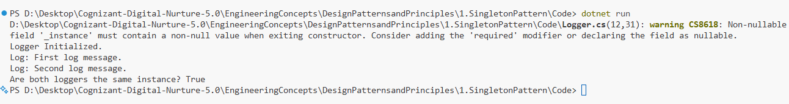

# Exercise 1: Implementing the Singleton Pattern

## Developer Info
- **Name**: Nirnay Ghosh
- **Assignment**: Cognizant Digital Nurture 5.0  
- **Skill**: Design Principles and Patterns  

---

## Problem Statement

You need to ensure that a logging utility class in your application has only **one instance** throughout the application lifecycle to guarantee **consistent logging**.

---

## Objectives

- Implement the **Singleton Design Pattern** in C#
- Ensure only one instance of the `Logger` class is used globally
- Test and demonstrate the singleton behavior

---

## Implementation Details

### Classes Used
- `Logger`: A singleton logging class  
- `Program`: Used to test singleton behavior

### Features
- `Logger` has:
  - A **private constructor**
  - A **private static instance**
  - A **public static GetInstance()** method
- Verifies that multiple logger variables refer to the **same instance**

---

## Design Pattern

| Pattern Name | Singleton |
|--------------|-----------|
| Intent       | Ensure a class has only one instance and provide a global point of access to it |
| Use Case     | Logging, caching, configuration, thread pools |

---

## Output Screenshot

Below is the sample output from the console:



---

## How to Run

```bash
cd DesignPatternsandPrinciples/1.SingletonPattern/Code
dotnet run