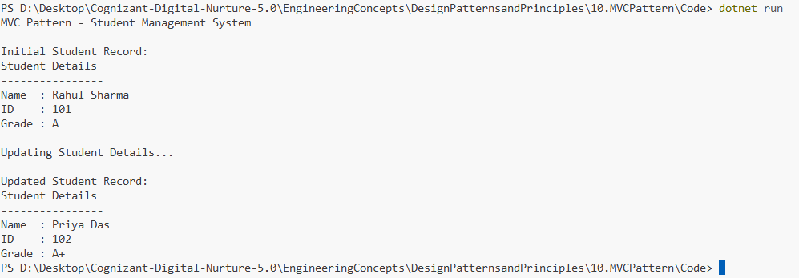

# Exercise 10: Implementing the MVC Pattern

## 👨‍💻 Developer Info
- **Name**: Nirnay Ghosh
- **Assignment**: Cognizant Digital Nurture 5.0
- **Skill**: Design Patterns and Principles

---

## 🧠 Problem Statement

Develop a Student Management System using the MVC (Model-View-Controller) Pattern.

The MVC Pattern separates application data, user interface, and business logic into distinct components, making applications easier to maintain, test, and extend.

---

## ✅ Objectives

- Create a Student model.
- Create a Student view for displaying information.
- Create a Student controller to manage interactions.
- Demonstrate updating and displaying student records.
- Understand separation of concerns using MVC.

---

## 🏗️ Implementation Details

### 👨‍🔧 Classes Used

#### Model

- `Student`

Attributes:

```csharp
Name
Id
Grade
```

Responsible for storing student data.

---

#### View

- `StudentView`

Method:

```csharp
DisplayStudentDetails()
```

Responsible for presenting data to the user.

---

#### Controller

- `StudentController`

Methods:

```csharp
SetStudentName()
GetStudentName()

SetStudentId()
GetStudentId()

SetStudentGrade()
GetStudentGrade()

UpdateView()
```

Responsible for:

- Managing user interactions
- Updating model data
- Coordinating between Model and View

---

## 🛠️ Pattern Details

| Pattern Name | MVC (Model-View-Controller) |
|--------------|-----------------------------|
| Category | Architectural Pattern |
| Intent | Separate data, UI, and control logic |
| Usage | Web Applications, Desktop Applications |
| Benefit | Better maintainability and scalability |

---

## 🔄 MVC Structure

```text
           User
             |
             v
      +--------------+
      | Controller   |
      +--------------+
        |          |
        |          |
        v          v
   +---------+   +---------+
   | Model   |   | View    |
   +---------+   +---------+

Model = Student Data
View = Display Information
Controller = Handles Requests
```

---

## 📚 Responsibilities

### Model (Student)

Stores:

- Student Name
- Student ID
- Student Grade

Example:

```csharp
Student student =
    new Student("Rahul Sharma", 101, "A");
```

---

### View (StudentView)

Displays student information:

```csharp
view.DisplayStudentDetails(
    name,
    id,
    grade
);
```

---

### Controller (StudentController)

Updates model data:

```csharp
controller.SetStudentName("Priya Das");
controller.SetStudentGrade("A+");
```

Refreshes the view:

```csharp
controller.UpdateView();
```

---

## 🚀 Workflow

### Step 1

Create Model

```csharp
Student student =
    new Student("Rahul Sharma",101,"A");
```

---

### Step 2

Create View

```csharp
StudentView view =
    new StudentView();
```

---

### Step 3

Create Controller

```csharp
StudentController controller =
    new StudentController(student, view);
```

---

### Step 4

Display Student Details

```csharp
controller.UpdateView();
```

---

### Step 5

Modify Student Details

```csharp
controller.SetStudentName("Priya Das");
controller.SetStudentGrade("A+");
```

---

### Step 6

Refresh View

```csharp
controller.UpdateView();
```

---

## 📸 Output Screenshot

Below is a sample output after running the program:



---

## 🧪 How to Run

```bash
cd DesignPatternsandPrinciples/10.MVCPattern/Code
dotnet run
```

---

## 🎯 Expected Output

```text
MVC Pattern - Student Management System

Initial Student Record:

Student Details
----------------
Name  : Rahul Sharma
ID    : 101
Grade : A

Updating Student Details...

Updated Student Record:

Student Details
----------------
Name  : Priya Das
ID    : 102
Grade : A+
```

---

## 🎓 Conclusion

The MVC Pattern separates an application into three interconnected components:

- Model → Stores data
- View → Displays data
- Controller → Manages communication

Benefits include:

- Better code organization
- Easier maintenance
- Improved scalability
- Separation of concerns
- Reusable components

MVC is widely used in ASP.NET MVC, Spring MVC, Django, Ruby on Rails, and many modern web application frameworks.