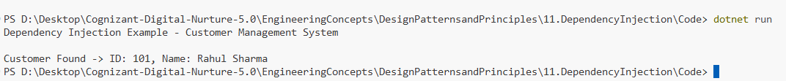

# Exercise 11: Implementing Dependency Injection

## 👨‍💻 Developer Info
- **Name**: Nirnay Ghosh
- **Assignment**: Cognizant Digital Nurture 5.0
- **Skill**: Design Patterns and Principles

---

## 🧠 Problem Statement

Develop a Customer Management System where the service layer depends on a repository layer.

Dependency Injection (DI) is used to provide dependencies externally instead of creating them inside the class. This promotes loose coupling, easier testing, and better maintainability.

---

## ✅ Objectives

- Create a repository interface.
- Implement a concrete repository class.
- Create a service class dependent on the repository.
- Inject dependencies using Constructor Injection.
- Demonstrate Dependency Injection in action.

---

## 🏗️ Implementation Details

### 👨‍🔧 Interfaces & Classes

#### Repository Interface

- `ICustomerRepository`

Method:

```csharp
FindCustomerById(int customerId)
```

Responsible for customer data access.

---

#### Concrete Repository

- `CustomerRepositoryImpl`

Implements:

```csharp
ICustomerRepository
```

Provides customer lookup functionality.

---

#### Service Class

- `CustomerService`

Responsibilities:

- Handle business logic.
- Use repository methods.
- Depend only on abstraction.

---

## 🔧 Dependency Injection Used

### Constructor Injection

```csharp
public CustomerService(
    ICustomerRepository customerRepository)
{
    this.customerRepository = customerRepository;
}
```

The dependency is supplied from outside rather than created internally.

---

## 🛠️ Principle Applied

### Dependency Inversion Principle (DIP)

High-level modules should not depend on low-level modules.

Instead:

```text
CustomerService
       ↓
ICustomerRepository
       ↑
CustomerRepositoryImpl
```

Both depend on the abstraction.

---

## 🔄 Dependency Flow

```text
Program
   |
   v
CustomerRepositoryImpl
   |
   v
CustomerService
   |
   v
FindCustomerById()
```

---

## 📚 Why Dependency Injection?

Without Dependency Injection:

```csharp
CustomerService service =
    new CustomerService();

service internally creates repository.
```

Problems:

- Tight coupling
- Difficult testing
- Harder maintenance

---

With Dependency Injection:

```csharp
ICustomerRepository repository =
    new CustomerRepositoryImpl();

CustomerService service =
    new CustomerService(repository);
```

Benefits:

- Loose coupling
- Easier unit testing
- Better flexibility
- Improved maintainability

---

## 🚀 Example Execution

### Create Repository

```csharp
ICustomerRepository repository =
    new CustomerRepositoryImpl();
```

---

### Inject Dependency

```csharp
CustomerService service =
    new CustomerService(repository);
```

---

### Use Service

```csharp
service.GetCustomer(101);
```

---

## 📸 Output Screenshot

Below is a sample output after running the program:



---

## 🧪 How to Run

```bash
cd DesignPatternsandPrinciples/11.DependencyInjection/Code
dotnet run
```

---

## 🎯 Expected Output

```text
Dependency Injection Example - Customer Management System

Customer Found -> ID: 101, Name: Rahul Sharma
```

---

## 🎓 Conclusion

Dependency Injection helps achieve loose coupling by injecting dependencies from outside rather than creating them internally.

Key Benefits:

- Better maintainability
- Improved testability
- Adherence to SOLID principles
- Flexible architecture
- Easier replacement of implementations

Dependency Injection is widely used in ASP.NET Core, Spring Framework, Angular, and enterprise-level applications where scalable and maintainable software architecture is required.