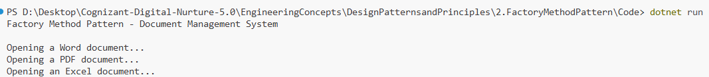

# Exercise 2: Implementing the Factory Method Pattern

## 👨‍💻 Developer Info
- **Name**: Nirnay Ghosh
- **Assignment**: Cognizant Digital Nurture 5.0  
- **Skill**: Design Patterns and Principles

---

## 🧠 Problem Statement

Create a system to manage different document types (Word, PDF, Excel) using the **Factory Method Design Pattern** in C#.

---

## ✅ Objectives

- Use abstract classes/interfaces to define document types
- Apply the Factory Method pattern to encapsulate document creation
- Demonstrate decoupling between the client and the object creation logic

---

## 🏗️ Implementation Details

### 👨‍🔧 Interfaces & Classes

- `IDocument`: Interface with `Open()` method
- Concrete Classes: `WordDocument`, `PdfDocument`, `ExcelDocument`
- `DocumentFactory`: Abstract class
- Factory Implementations: `WordDocumentFactory`, `PdfDocumentFactory`, `ExcelDocumentFactory`

---

## 🛠️ Pattern Details

| Pattern Name     | Factory Method Pattern |
|------------------|------------------------|
| Intent           | Define an interface for creating an object, but let subclasses decide which class to instantiate |
| Usage            | When the class doesn’t know what subclass it needs |

---

## 📸 Output Screenshot

Below is a sample output after running the program:



---

## 🧪 How to Run

```bash
cd DesignPatternsandPrinciples/2.FactoryMethodPattern/Code
dotnet run
    