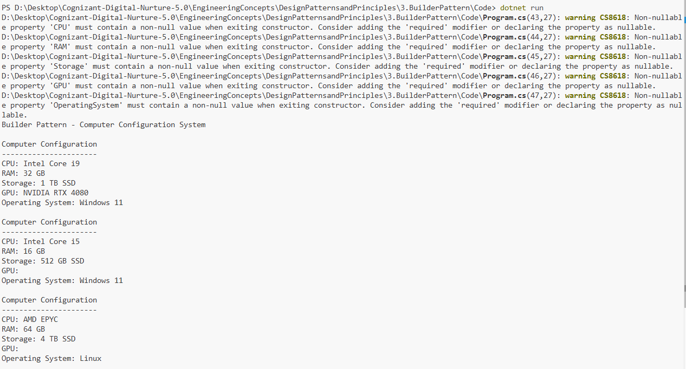

# Exercise 3: Implementing the Builder Pattern

## 👨‍💻 Developer Info
- **Name**: Nirnay Ghosh
- **Assignment**: Cognizant Digital Nurture 5.0
- **Skill**: Design Patterns and Principles

---

## 🧠 Problem Statement

Create a system to build complex Computer objects with multiple optional components such as CPU, RAM, Storage, GPU, and Operating System using the Builder Design Pattern.

The Builder Pattern separates object construction from its representation, allowing the same construction process to create different configurations.

---

## ✅ Objectives

- Create a Product class (`Computer`)
- Implement a nested Builder class
- Use method chaining for object creation
- Keep the Computer constructor private
- Demonstrate different Computer configurations

---

## 🏗️ Implementation Details

### 👨‍🔧 Classes Used

- `Computer` (Product Class)
- `Computer.Builder` (Builder Class)
- `Program` (Client)

---

## 🛠️ Pattern Details

| Pattern Name | Builder Pattern |
|--------------|----------------|
| Intent | Separate the construction of a complex object from its representation |
| Usage | When an object has many optional parameters |
| Benefit | Improves readability and flexibility |

---

## 🔧 Product Attributes

The `Computer` class contains:

- CPU
- RAM
- Storage
- GPU
- Operating System

These attributes can be configured independently using the Builder.

---

## 🏗️ Builder Methods

```csharp
SetCPU()
SetRAM()
SetStorage()
SetGPU()
SetOperatingSystem()
Build()
```

Method chaining allows easy object construction:

```csharp
Computer gamingPC = new Computer.Builder()
    .SetCPU("Intel Core i9")
    .SetRAM("32 GB")
    .SetStorage("1 TB SSD")
    .Build();
```

---

## 📸 Output Screenshot

Below is a sample output after running the program:



---

## 🧪 How to Run

```bash
cd DesignPatternsandPrinciples/3.BuilderPattern/Code
dotnet run
```

---

## 🎯 Expected Output

```text
Builder Pattern - Computer Configuration System

Computer Configuration
----------------------
CPU: Intel Core i9
RAM: 32 GB
Storage: 1 TB SSD
GPU: NVIDIA RTX 4080
Operating System: Windows 11

Computer Configuration
----------------------
CPU: Intel Core i5
RAM: 16 GB
Storage: 512 GB SSD
GPU:
Operating System: Windows 11

Computer Configuration
----------------------
CPU: AMD EPYC
RAM: 64 GB
Storage: 4 TB SSD
GPU:
Operating System: Linux
```

---

## 🎓 Conclusion

The Builder Pattern is useful when creating complex objects with many optional parameters. It improves code readability, avoids large constructors, and allows flexible object creation through method chaining.