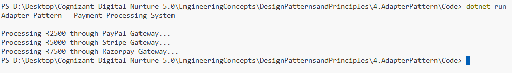

# Exercise 4: Implementing the Adapter Pattern

## 👨‍💻 Developer Info
- **Name**: Nirnay Ghosh
- **Assignment**: Cognizant Digital Nurture 5.0
- **Skill**: Design Patterns and Principles

---

## 🧠 Problem Statement

Develop a payment processing system that can integrate with multiple third-party payment gateways having different interfaces.

The Adapter Pattern is used to provide a common interface for all payment gateways, allowing the client application to work with them uniformly.

---

## ✅ Objectives

- Define a common payment processing interface.
- Integrate multiple payment gateways with different APIs.
- Use the Adapter Pattern to bridge incompatible interfaces.
- Demonstrate payment processing through a unified interface.

---

## 🏗️ Implementation Details

### 👨‍🔧 Interfaces & Classes

#### Target Interface

- `IPaymentProcessor`

#### Adaptee Classes

- `PayPalGateway`
- `StripeGateway`
- `RazorpayGateway`

Each gateway exposes a different payment method:

| Gateway | Method |
|----------|---------|
| PayPal | `MakePayment()` |
| Stripe | `Pay()` |
| Razorpay | `SendPayment()` |

#### Adapter Classes

- `PayPalAdapter`
- `StripeAdapter`
- `RazorpayAdapter`

Each adapter implements `IPaymentProcessor` and internally translates the request to the appropriate gateway-specific method.

---

## 🛠️ Pattern Details

| Pattern Name | Adapter Pattern |
|--------------|----------------|
| Intent | Convert one interface into another interface clients expect |
| Category | Structural Pattern |
| Usage | Integrating incompatible third-party libraries |
| Benefit | Enables classes with different interfaces to work together |

---

## 🔄 Adapter Structure

```text
Client
   |
   v
IPaymentProcessor
   |
   +------------------+
   |        |         |
   v        v         v
PayPal   Stripe   Razorpay
Adapter  Adapter  Adapter
   |        |         |
   v        v         v
PayPal   Stripe   Razorpay
Gateway  Gateway  Gateway
```

---

## 💳 Payment Gateways Used

### PayPal Gateway

```csharp
MakePayment(amount)
```

### Stripe Gateway

```csharp
Pay(amount)
```

### Razorpay Gateway

```csharp
SendPayment(amount)
```

---

## 📸 Output Screenshot

Below is a sample output after running the program:



---

## 🧪 How to Run

```bash
cd DesignPatternsandPrinciples/4.AdapterPattern/Code
dotnet run
```

---

## 🎯 Expected Output

```text
Adapter Pattern - Payment Processing System

Processing ₹2500 through PayPal Gateway...
Processing ₹5000 through Stripe Gateway...
Processing ₹7500 through Razorpay Gateway...
```

---

## 🎓 Conclusion

The Adapter Pattern allows incompatible payment gateway interfaces to work seamlessly with a common payment processing interface.

This improves flexibility, promotes code reusability, and simplifies integration of new payment gateways without changing existing client code.