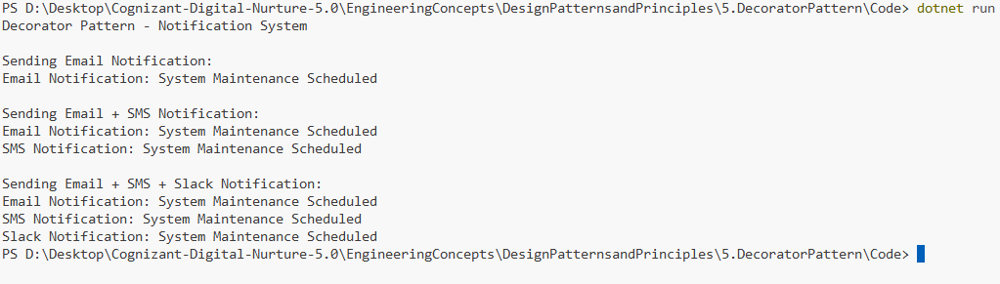

# Exercise 5: Implementing the Decorator Pattern

## 👨‍💻 Developer Info
- **Name**: Nirnay Ghosh
- **Assignment**: Cognizant Digital Nurture 5.0
- **Skill**: Design Patterns and Principles

---

## 🧠 Problem Statement

Develop a notification system where notifications can be sent through multiple channels such as Email, SMS, and Slack.

The Decorator Pattern is used to dynamically add new notification channels without modifying existing classes.

---

## ✅ Objectives

- Create a common notification interface.
- Implement Email notification functionality.
- Add SMS and Slack notification capabilities dynamically.
- Demonstrate flexible notification channel combinations using decorators.

---

## 🏗️ Implementation Details

### 👨‍🔧 Interfaces & Classes

#### Component Interface

- `INotifier`

#### Concrete Component

- `EmailNotifier`

#### Abstract Decorator

- `NotifierDecorator`

#### Concrete Decorators

- `SMSNotifierDecorator`
- `SlackNotifierDecorator`

---

## 🛠️ Pattern Details

| Pattern Name | Decorator Pattern |
|--------------|------------------|
| Category | Structural Pattern |
| Intent | Add responsibilities to objects dynamically |
| Usage | Extend functionality without modifying existing code |
| Benefit | Follows Open/Closed Principle |

---

## 🔄 Decorator Structure

```text
                  INotifier
                      |
        -----------------------------
        |                           |
 EmailNotifier           NotifierDecorator
                                    |
                    -------------------------
                    |                       |
          SMSNotifierDecorator   SlackNotifierDecorator
```

---

## 📢 Notification Channels

### Email

```csharp
EmailNotifier
```

Sends notifications through email.

---

### SMS

```csharp
SMSNotifierDecorator
```

Adds SMS notification capability.

---

### Slack

```csharp
SlackNotifierDecorator
```

Adds Slack notification capability.

---

## 🔧 Example Usage

### Email Only

```csharp
INotifier notifier = new EmailNotifier();
```

### Email + SMS

```csharp
INotifier notifier =
    new SMSNotifierDecorator(
        new EmailNotifier());
```

### Email + SMS + Slack

```csharp
INotifier notifier =
    new SlackNotifierDecorator(
        new SMSNotifierDecorator(
            new EmailNotifier()));
```

---

## 📸 Output Screenshot

Below is a sample output after running the program:



---

## 🧪 How to Run

```bash
cd DesignPatternsandPrinciples/5.DecoratorPattern/Code
dotnet run
```

---

## 🎯 Expected Output

```text
Decorator Pattern - Notification System

Sending Email Notification:
Email Notification: System Maintenance Scheduled

Sending Email + SMS Notification:
Email Notification: System Maintenance Scheduled
SMS Notification: System Maintenance Scheduled

Sending Email + SMS + Slack Notification:
Email Notification: System Maintenance Scheduled
SMS Notification: System Maintenance Scheduled
Slack Notification: System Maintenance Scheduled
```

---

## 🎓 Conclusion

The Decorator Pattern enables adding new notification channels dynamically without changing existing classes.

This approach promotes flexibility, scalability, and adherence to the Open/Closed Principle. New notification types can be introduced simply by creating additional decorators and combining them with existing ones.