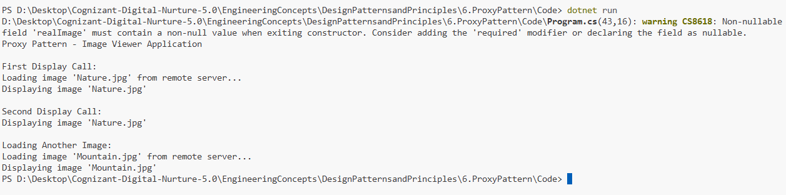

# Exercise 6: Implementing the Proxy Pattern

## 👨‍💻 Developer Info
- **Name**: Nirnay Ghosh
- **Assignment**: Cognizant Digital Nurture 5.0
- **Skill**: Design Patterns and Principles

---

## 🧠 Problem Statement

Develop an image viewer application that loads images from a remote server.

Since loading images from a server is expensive, the Proxy Pattern is used to provide lazy initialization and caching. Images are loaded only when required and reused thereafter.

---

## ✅ Objectives

- Create a common image interface.
- Implement a real image class that loads images from a remote server.
- Implement a proxy image class.
- Apply lazy initialization.
- Demonstrate image caching behavior.

---

## 🏗️ Implementation Details

### 👨‍🔧 Interfaces & Classes

#### Subject Interface

- `IImage`

#### Real Subject

- `RealImage`

Responsible for:

- Loading images from the remote server
- Displaying images

#### Proxy

- `ProxyImage`

Responsible for:

- Lazy initialization
- Caching the loaded image
- Delegating requests to RealImage

---

## 🛠️ Pattern Details

| Pattern Name | Proxy Pattern |
|--------------|--------------|
| Category | Structural Pattern |
| Intent | Provide a placeholder or surrogate for another object |
| Usage | Control access to expensive resources |
| Benefit | Improves performance and resource utilization |

---

## 🔄 Proxy Structure

```text
Client
   |
   v
 IImage
   |
   +----------------+
   |                |
   v                v
ProxyImage ---> RealImage
                   |
                   v
            Remote Server
```

---

## 🚀 Key Features

### Lazy Initialization

The image is not loaded when the proxy object is created.

```csharp
IImage image = new ProxyImage("Nature.jpg");
```

No server call happens yet.

The image is loaded only when:

```csharp
image.Display();
```

is executed.

---

### Caching

After the image is loaded once, the same instance is reused.

```csharp
image.Display();
image.Display();
```

The second call does not reload the image from the server.

---

## 📸 Output Screenshot

Below is a sample output after running the program:



---

## 🧪 How to Run

```bash
cd DesignPatternsandPrinciples/6.ProxyPattern/Code
dotnet run
```

---

## 🎯 Expected Output

```text
Proxy Pattern - Image Viewer Application

First Display Call:
Loading image 'Nature.jpg' from remote server...
Displaying image 'Nature.jpg'

Second Display Call:
Displaying image 'Nature.jpg'

Loading Another Image:
Loading image 'Mountain.jpg' from remote server...
Displaying image 'Mountain.jpg'
```

---

## 🔍 How Caching Works

### First Request

```text
ProxyImage
     ↓
RealImage created
     ↓
Image loaded from server
     ↓
Image displayed
```

### Subsequent Requests

```text
ProxyImage
     ↓
Existing RealImage reused
     ↓
Image displayed
```

No additional server loading occurs.

---

## 🎓 Conclusion

The Proxy Pattern acts as a substitute for the real image object and delays expensive image loading until it is actually needed.

This implementation improves application performance by:

- Reducing unnecessary server requests
- Supporting lazy initialization
- Providing caching of loaded images

The Proxy Pattern is commonly used in image viewers, virtual memory systems, database access layers, and remote service applications.