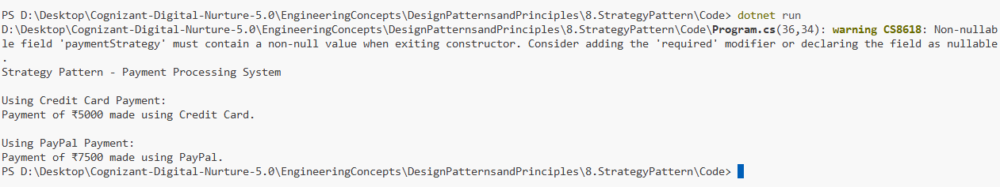

# Exercise 8: Implementing the Strategy Pattern

## 👨‍💻 Developer Info
- **Name**: Nirnay Ghosh
- **Assignment**: Cognizant Digital Nurture 5.0
- **Skill**: Design Patterns and Principles

---

## 🧠 Problem Statement

Develop a payment processing system that supports multiple payment methods such as Credit Card and PayPal.

The Strategy Pattern is used to encapsulate different payment algorithms and allow the client to select a payment method at runtime.

---

## ✅ Objectives

- Create a common payment strategy interface.
- Implement multiple payment methods.
- Allow payment methods to be changed dynamically.
- Demonstrate runtime selection of payment strategies.

---

## 🏗️ Implementation Details

### 👨‍🔧 Interfaces & Classes

#### Strategy Interface

- `IPaymentStrategy`

Method:

```csharp
Pay(double amount)
```

---

#### Concrete Strategies

##### CreditCardPayment

```csharp
CreditCardPayment
```

Processes payment through a Credit Card.

##### PayPalPayment

```csharp
PayPalPayment
```

Processes payment through PayPal.

---

#### Context Class

##### PaymentContext

Responsibilities:

- Store the selected payment strategy.
- Execute the payment using the current strategy.

Methods:

```csharp
SetPaymentStrategy()
ExecutePayment()
```

---

## 🛠️ Pattern Details

| Pattern Name | Strategy Pattern |
|--------------|------------------|
| Category | Behavioral Pattern |
| Intent | Define a family of algorithms and make them interchangeable |
| Usage | Runtime selection of business logic |
| Benefit | Eliminates complex conditional statements |

---

## 🔄 Strategy Structure

```text
                    +----------------------+
                    |  IPaymentStrategy    |
                    +----------------------+
                               |
                -----------------------------
                |                           |
                v                           v
      CreditCardPayment          PayPalPayment

                               ^
                               |
                     +------------------+
                     | PaymentContext   |
                     +------------------+
```

---

## 💳 Available Payment Strategies

### Credit Card Payment

```csharp
paymentContext.SetPaymentStrategy(
    new CreditCardPayment());
```

Output:

```text
Payment of ₹5000 made using Credit Card.
```

---

### PayPal Payment

```csharp
paymentContext.SetPaymentStrategy(
    new PayPalPayment());
```

Output:

```text
Payment of ₹7500 made using PayPal.
```

---

## 🚀 Runtime Strategy Switching

The Strategy Pattern allows changing payment methods dynamically.

Example:

```csharp
paymentContext.SetPaymentStrategy(
    new CreditCardPayment());

paymentContext.ExecutePayment(5000);

paymentContext.SetPaymentStrategy(
    new PayPalPayment());

paymentContext.ExecutePayment(7500);
```

No changes are required in the `PaymentContext` class.

---

## 📸 Output Screenshot

Below is a sample output after running the program:



---

## 🧪 How to Run

```bash
cd DesignPatternsandPrinciples/8.StrategyPattern/Code
dotnet run
```

---

## 🎯 Expected Output

```text
Strategy Pattern - Payment Processing System

Using Credit Card Payment:
Payment of ₹5000 made using Credit Card.

Using PayPal Payment:
Payment of ₹7500 made using PayPal.
```

---

## 🎓 Conclusion

The Strategy Pattern allows multiple payment algorithms to be encapsulated into separate classes and selected dynamically at runtime.

Benefits include:

- Loose coupling
- Better maintainability
- Easy addition of new payment methods
- Compliance with the Open/Closed Principle

This pattern is widely used in payment gateways, sorting algorithms, authentication mechanisms, and pricing engines where behavior must be selected dynamically.