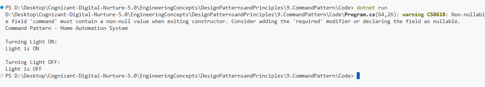

# Exercise 9: Implementing the Command Pattern

## 👨‍💻 Developer Info
- **Name**: Nirnay Ghosh
- **Assignment**: Cognizant Digital Nurture 5.0
- **Skill**: Design Patterns and Principles

---

## 🧠 Problem Statement

Develop a Home Automation System where commands can be issued to control devices such as lights.

The Command Pattern is used to encapsulate requests as objects, allowing commands to be parameterized, queued, and executed independently of the objects that perform the actions.

---

## ✅ Objectives

- Create a Command interface.
- Implement commands to turn a light ON and OFF.
- Create a Remote Control that executes commands.
- Separate the command sender from the command receiver.
- Demonstrate command execution using a home automation example.

---

## 🏗️ Implementation Details

### 👨‍🔧 Interfaces & Classes

#### Command Interface

- `ICommand`

Method:

```csharp
Execute()
```

---

#### Receiver

- `Light`

Methods:

```csharp
TurnOn()
TurnOff()
```

Responsible for performing the actual operations.

---

#### Concrete Commands

##### LightOnCommand

```csharp
LightOnCommand
```

Turns the light ON.

##### LightOffCommand

```csharp
LightOffCommand
```

Turns the light OFF.

---

#### Invoker

##### RemoteControl

Methods:

```csharp
SetCommand()
PressButton()
```

Responsible for triggering commands.

---

## 🛠️ Pattern Details

| Pattern Name | Command Pattern |
|--------------|----------------|
| Category | Behavioral Pattern |
| Intent | Encapsulate requests as objects |
| Usage | Decouple sender and receiver |
| Benefit | Flexible command execution and extensibility |

---

## 🔄 Command Structure

```text
                   +-----------+
                   | ICommand  |
                   +-----------+
                         |
                ------------------
                |                |
                v                v
       LightOnCommand    LightOffCommand
                |                |
                +-------+--------+
                        |
                        v
                     Light
                   (Receiver)

                        ^
                        |
                +---------------+
                | RemoteControl |
                +---------------+
                    (Invoker)
```

---

## 💡 Workflow

### Step 1: Create Receiver

```csharp
Light light = new Light();
```

---

### Step 2: Create Commands

```csharp
ICommand lightOn =
    new LightOnCommand(light);

ICommand lightOff =
    new LightOffCommand(light);
```

---

### Step 3: Assign Command to Invoker

```csharp
remote.SetCommand(lightOn);
```

---

### Step 4: Execute Command

```csharp
remote.PressButton();
```

Output:

```text
Light is ON
```

---

## 📸 Output Screenshot

Below is a sample output after running the program:



---

## 🧪 How to Run

```bash
cd DesignPatternsandPrinciples/9.CommandPattern/Code
dotnet run
```

---

## 🎯 Expected Output

```text
Command Pattern - Home Automation System

Turning Light ON:
Light is ON

Turning Light OFF:
Light is OFF
```

---

## 🎓 Conclusion

The Command Pattern encapsulates actions as command objects, allowing the sender (RemoteControl) to remain independent of the receiver (Light).

Benefits include:

- Loose coupling between sender and receiver
- Easy addition of new commands
- Better extensibility and maintainability
- Support for features like undo, logging, and command queues

This pattern is commonly used in GUI buttons, remote controls, menu actions, task schedulers, and home automation systems.