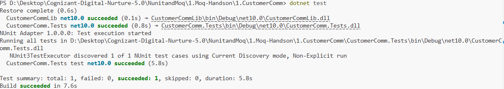

# Exercise 1: Write Testable Code with Moq

## 👨‍💻 Developer Info

* **Name**: Nirnay Ghosh
* **Assignment**: Cognizant Digital Nurture 5.0
* **Skill**: NUnit and Moq

---

## 🧠 Problem Statement

Develop a customer communication module that sends emails to customers after every transaction.

Since sending actual emails during unit testing is undesirable and introduces dependency on external SMTP servers, the MailSender dependency must be mocked using the Moq framework.

This allows testing the business logic independently without communicating with a real mail server.

---

## ✅ Objectives

* Create an interface for email communication.
* Implement a concrete mail sender class.
* Apply Dependency Injection using Constructor Injection.
* Create a unit test project using NUnit.
* Mock external dependencies using Moq.
* Verify the functionality of the CustomerComm class.

---

## 🏗️ Implementation Details

### 👨‍🔧 Components Used

#### IMailSender Interface

Defines the contract for sending emails.

```csharp
public interface IMailSender
{
    bool SendMail(string toAddress, string message);
}
```

---

#### MailSender Class

Implements the IMailSender interface and contains SMTP communication logic.

Responsibilities:

* Create email messages.
* Configure SMTP settings.
* Send emails to customers.

---

#### CustomerComm Class

Acts as the business layer.

Uses Dependency Injection to receive an IMailSender dependency through its constructor.

```csharp
public CustomerComm(IMailSender mailSender)
{
    _mailSender = mailSender;
}
```

This enables the mail sender implementation to be replaced with a mock object during testing.

---

## 🧪 Unit Testing

### Frameworks Used

* NUnit
* NUnit Test Adapter
* Moq

### Test Scenario

Verify that the method `SendMailToCustomer()` returns `true` when the mail sending operation succeeds.

### Mock Configuration

```csharp
mockMailSender
    .Setup(x =>
        x.SendMail(
            It.IsAny<string>(),
            It.IsAny<string>()
        ))
    .Returns(true);
```

The mock object:

* Accepts any email address.
* Accepts any message.
* Always returns `true`.

No real SMTP server communication occurs during testing.

---

## 🔧 Concepts Demonstrated

* Dependency Injection
* Constructor Injection
* Mock Objects
* Unit Testing
* Loose Coupling
* Testable Code Design

---

## 📂 Project Structure

```text
NunitandMoq
│
└── 1.Moq-Handson
    │
    └── 1.CustomerComm
        │
        ├── CustomerComm.sln
        │
        ├── CustomerCommLib
        │   ├── IMailSender.cs
        │   ├── MailSender.cs
        │   └── CustomerComm.cs
        │
        ├── CustomerComm.Tests
        │   └── CustomerCommTests.cs
        │
        ├── Output
        │   └── Output.png
        │
        └── README.md
```

---

## 🛠️ Technologies Used

* C#
* .NET
* NUnit
* Moq
* Dependency Injection

---

## 📸 Output Screenshot

Below is the successful execution of the NUnit test case:



### Screenshot Location

```text
NunitandMoq/
└── 1.Moq-Handson/
    └── 1.CustomerComm/
        └── Output/
            └── Output.png
```

---

## 🧪 How to Run

### Step 1: Navigate to Project Folder

```bash
cd "NunitandMoq/1.Moq-Handson/1.CustomerComm"
```

### Step 2: Restore Dependencies

```bash
dotnet restore
```

### Step 3: Run Unit Tests

```bash
dotnet test
```

---

## 🎯 Actual Output

```text
Restore complete

CustomerCommLib net10.0 succeeded

CustomerComm.Tests net10.0 succeeded

NUnit Adapter 1.0.0.0: Test execution started

Running all tests in CustomerComm.Tests.dll

NUnit3TestExecutor discovered 1 of 1 NUnit test cases

Test summary:
total: 1
failed: 0
succeeded: 1
skipped: 0

Build succeeded
```

---

## 📊 Test Result Summary

| Metric      | Result |
| ----------- | ------ |
| Total Tests | 1      |
| Passed      | 1      |
| Failed      | 0      |
| Skipped     | 0      |

---

## 🎓 Conclusion

This exercise demonstrates how Moq can be used to replace external dependencies with mock objects during unit testing.

By injecting the IMailSender dependency into the CustomerComm class and mocking it during testing, we successfully verified the business logic without connecting to a real SMTP server.

### Benefits Achieved

* Faster test execution.
* No dependency on external services.
* Better maintainability.
* Loose coupling between components.
* Improved testability through Dependency Injection.

The combination of NUnit and Moq provides an effective approach for testing applications that interact with external resources while maintaining isolation and reliability.
