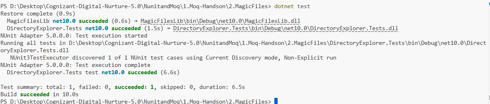

# Exercise 2: Mock File Object for Unit Tests

## 👨‍💻 Developer Info

* **Name**: Nirnay Ghosh
* **Assignment**: Cognizant Digital Nurture 5.0
* **Skill**: NUnit and Moq

---

## 🧠 Problem Statement

Develop a unit test for a file system utility that retrieves files from a specified directory.

The existing implementation directly uses the static method `Directory.GetFiles()` from the `System.IO` namespace. Static methods are difficult to unit test because they cannot be mocked directly.

To improve testability, the file retrieval functionality is abstracted behind an interface and mocked using the Moq framework. This enables testing without accessing the actual file system.

---

## ✅ Objectives

* Create an interface for directory exploration.
* Implement a concrete directory explorer class.
* Mock file system operations using Moq.
* Write NUnit test cases.
* Verify file retrieval functionality without depending on physical files or directories.

---

## 🏗️ Implementation Details

### 👨‍🔧 Components Used

#### IDirectoryExplorer Interface

Defines the contract for retrieving files from a directory.

```csharp
public interface IDirectoryExplorer
{
    ICollection<string> GetFiles(string path);
}
```

---

#### DirectoryExplorer Class

Implements the `IDirectoryExplorer` interface.

Uses the `Directory.GetFiles()` method internally to retrieve files from the specified path.

```csharp
public class DirectoryExplorer : IDirectoryExplorer
{
    public ICollection<string> GetFiles(string path)
    {
        string[] files = Directory.GetFiles(path);
        return files;
    }
}
```

---

## 🧪 Unit Testing

### Frameworks Used

* NUnit
* NUnit Test Adapter
* Moq

### Test Data

```csharp
private readonly string _file1 = "file.txt";
private readonly string _file2 = "file2.txt";
```

### Mock Configuration

```csharp
mockDirectoryExplorer
    .Setup(x =>
        x.GetFiles(
            It.IsAny<string>()
        ))
    .Returns(files);
```

The mock object:

* Accepts any directory path.
* Returns a predefined collection of files.
* Eliminates dependency on the actual file system.

---

## 🔧 Concepts Demonstrated

* Mock Objects
* Unit Testing
* Dependency Abstraction
* Loose Coupling
* Testable Code Design
* File System Mocking

---

## 📂 Project Structure

```text
NunitandMoq
│
└── 1.Moq-Handson
    │
    └── 2.MagicFiles
        │
        ├── MagicFiles.sln
        │
        ├── MagicFilesLib
        │   ├── MagicFilesLib.csproj
        │   ├── IDirectoryExplorer.cs
        │   └── DirectoryExplorer.cs
        │
        ├── DirectoryExplorer.Tests
        │   ├── DirectoryExplorer.Tests.csproj
        │   └── DirectoryExplorerTests.cs
        │
        ├── Output
        │   └── Output.png
        │
        └── README.md
```

---

## 🛠️ Technologies Used

* C#
* .NET
* NUnit
* Moq
* System.IO

---

## 📸 Output Screenshot

Below is the successful execution of the NUnit test case:



### Screenshot Location

```text
NunitandMoq/
└── 1.Moq-Handson/
    └── 2.MagicFiles/
        └── Output/
            └── Output.png
```

---

## 🧪 How to Run

### Step 1: Navigate to the Project Folder

```bash
cd "NunitandMoq/1.Moq-Handson/2.MagicFiles"
```

### Step 2: Restore Dependencies

```bash
dotnet restore
```

### Step 3: Execute Unit Tests

```bash
dotnet test
```

---

## 🎯 Actual Output

```text
Restore complete

MagicFilesLib net10.0 succeeded

DirectoryExplorer.Tests net10.0 succeeded

NUnit Adapter 5.0.0.0: Test execution started

Running all tests in DirectoryExplorer.Tests.dll

NUnit3TestExecutor discovered 1 of 1 NUnit test cases

NUnit Adapter 5.0.0.0: Test execution complete

DirectoryExplorer.Tests test net10.0 succeeded

Test summary:
total: 1
failed: 0
succeeded: 1
skipped: 0
duration: 6.5s

Build succeeded
```

---

## 📊 Assertions Performed

| Assertion              | Purpose                                           |
| ---------------------- | ------------------------------------------------- |
| `Is.Not.Null`          | Verify the returned collection exists             |
| `Count = 2`            | Verify exactly two files are returned             |
| `Does.Contain(_file1)` | Verify the expected file exists in the collection |

---

## 📈 Test Result Summary

| Metric      | Result |
| ----------- | ------ |
| Total Tests | 1      |
| Passed      | 1      |
| Failed      | 0      |
| Skipped     | 0      |

---

## 🎓 Conclusion

This exercise demonstrates how file system operations can be unit tested without accessing the actual file system.

By introducing the `IDirectoryExplorer` abstraction and mocking it using Moq, we successfully isolated the business logic from external dependencies.

### Benefits Achieved

* Faster test execution.
* No dependency on physical files or directories.
* Better maintainability.
* Loose coupling between components.
* Reliable and repeatable unit tests.

Using NUnit and Moq together provides an effective approach for testing file-related functionality while keeping the tests independent of the operating system and file system environment.
