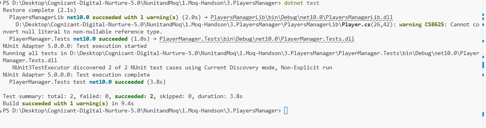

# Exercise 3: Mock Database for Unit Tests

## 👨‍💻 Developer Info

* **Name**: Nirnay Ghosh
* **Assignment**: Cognizant Digital Nurture 5.0
* **Skill**: NUnit and Moq

---

## 🧠 Problem Statement

Develop a unit test for a player management system that stores and retrieves player information from a database.

The existing implementation communicates directly with a database through the `PlayerMapper` class. Since database operations are external dependencies, they make unit testing difficult, slow, and unreliable.

To solve this problem, the database access layer is abstracted using an interface and mocked using the Moq framework. This enables testing the business logic independently from the database.

---

## ✅ Objectives

* Create an interface for database operations.
* Implement a concrete database mapper class.
* Create a Player class that depends on the mapper.
* Mock database interactions using Moq.
* Write NUnit test cases.
* Verify player registration functionality without connecting to a real database.

---

## 🏗️ Implementation Details

### 👨‍🔧 Components Used

#### IPlayerMapper Interface

Defines the contract for database operations.

```csharp
public interface IPlayerMapper
{
    bool IsPlayerNameExistsInDb(string name);
    void AddNewPlayerIntoDb(string name);
}
```

---

#### PlayerMapper Class

Implements the `IPlayerMapper` interface.

Responsibilities:

* Check whether a player already exists in the database.
* Add a new player record into the database.

---

#### Player Class

Represents a player entity.

Properties:

* Name
* Age
* Country
* NoOfMatches

Contains the factory method:

```csharp
RegisterNewPlayer()
```

which validates player details and interacts with the database layer.

---

## 🧪 Unit Testing

### Frameworks Used

* NUnit
* NUnit Test Adapter
* Moq

---

### Test Case 1

Verify successful player registration.

Mock configuration:

```csharp
mockMapper
    .Setup(x =>
        x.IsPlayerNameExistsInDb(
            It.IsAny<string>()))
    .Returns(false);
```

This ensures:

* The player name does not already exist.
* The registration process succeeds.

Assertions performed:

```csharp
Assert.That(player.Name, Is.EqualTo("Virat"));
Assert.That(player.Age, Is.EqualTo(23));
Assert.That(player.Country, Is.EqualTo("India"));
Assert.That(player.NoOfMatches, Is.EqualTo(30));
```

---

### Test Case 2

Verify exception handling when an invalid player name is provided.

```csharp
Assert.Throws<ArgumentException>(
    () =>
    {
        Player.RegisterNewPlayer(
            "",
            mockMapper.Object);
    });
```

---

## 🔧 Concepts Demonstrated

* Mock Objects
* Dependency Injection
* Unit Testing
* Database Mocking
* Loose Coupling
* Exception Testing
* Testable Code Design

---

## 📂 Project Structure

```text
NunitandMoq
│
└── 1.Moq-Handson
    │
    └── 3.PlayersManager
        │
        ├── PlayersManager.sln
        │
        ├── PlayersManagerLib
        │   ├── PlayersManagerLib.csproj
        │   ├── IPlayerMapper.cs
        │   ├── PlayerMapper.cs
        │   └── Player.cs
        │
        ├── PlayerManager.Tests
        │   ├── PlayerManager.Tests.csproj
        │   └── PlayerTests.cs
        │
        ├── Output
        │   └── Output.png
        │
        └── README.md
```

---

## 🛠️ Technologies Used

* C#
* .NET
* NUnit
* Moq
* SQL Server Concepts
* Dependency Injection

---

## 📸 Output Screenshot

Below is the successful execution of the NUnit test cases:



### Screenshot Location

```text
NunitandMoq/
└── 1.Moq-Handson/
    └── 3.PlayersManager/
        └── Output/
            └── Output.png
```

---

## 🧪 How to Run

### Step 1: Navigate to Project Folder

```bash
cd "NunitandMoq/1.Moq-Handson/3.PlayersManager"
```

### Step 2: Restore Dependencies

```bash
dotnet restore
```

### Step 3: Execute Unit Tests

```bash
dotnet test
```

---

## 🎯 Expected Output

```text
Restore complete

PlayersManagerLib net10.0 succeeded

PlayerManager.Tests net10.0 succeeded

NUnit Adapter 5.0.0.0: Test execution started

NUnit3TestExecutor discovered 2 of 2 NUnit test cases

PlayerManager.Tests test net10.0 succeeded

Test summary:
total: 2
failed: 0
succeeded: 2
skipped: 0

Build succeeded
```

---

## 📊 Assertions Performed

| Assertion                | Purpose                                    |
| ------------------------ | ------------------------------------------ |
| Name = "Virat"           | Verify player name                         |
| Age = 23                 | Verify player age                          |
| Country = "India"        | Verify player country                      |
| NoOfMatches = 30         | Verify player matches count                |
| Throws ArgumentException | Verify validation for invalid player names |

---

## 📈 Test Result Summary

| Metric      | Result |
| ----------- | ------ |
| Total Tests | 2      |
| Passed      | 2      |
| Failed      | 0      |
| Skipped     | 0      |

---

## 🎓 Conclusion

This exercise demonstrates how external database dependencies can be isolated during unit testing using Moq.

By introducing the `IPlayerMapper` abstraction and mocking database interactions, we successfully tested the player registration logic without connecting to a real database.

### Benefits Achieved

* Faster test execution.
* No database dependency.
* Better maintainability.
* Improved code testability.
* Reliable automated testing.
* Loose coupling between business logic and data access layer.

Using NUnit and Moq together provides an efficient way to test applications that interact with databases while keeping tests independent of external resources.
