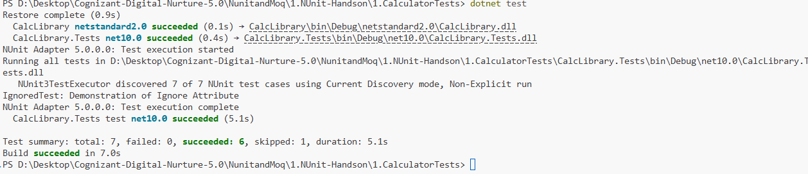

# Exercise 1: Calculator Unit Testing using NUnit

## 👨‍💻 Developer Info

- **Name**: Nirnay Ghosh
- **Assignment**: Cognizant Digital Nurture 5.0
- **Module**: NUnit Framework
- **Topic**: Unit Testing Fundamentals

---

## 🧠 Problem Statement

Develop and execute automated unit tests for a calculator library using the NUnit testing framework.

The objective is to validate calculator operations independently while understanding the concepts of automated testing, parameterized tests, and test lifecycle management.

---

## 🎯 Learning Objectives

- Understand Unit Testing and Functional Testing
- Learn various software testing methodologies
- Understand loosely coupled and testable design
- Write automated unit tests using NUnit
- Use NUnit attributes such as:
  - TestFixture
  - SetUp
  - TearDown
  - Test
  - TestCase
  - Ignore
- Implement parameterized test cases
- Validate calculator operations automatically

---

## 📚 Types of Testing

### Unit Testing
Tests individual methods or classes in isolation.

### Functional Testing
Tests complete application functionality against business requirements.

### Automated Testing
Uses tools and frameworks to execute tests automatically.

### Performance Testing
Measures application responsiveness, scalability, and stability.

---

## 🔍 Unit Testing vs Functional Testing

| Feature | Unit Testing | Functional Testing |
|----------|-------------|-------------------|
| Scope | Individual Method/Class | Complete Feature |
| Speed | Fast | Slower |
| Dependencies | Mocked/Isolated | Real Components |
| Purpose | Verify Logic | Verify Business Requirements |

---

## ✅ Benefits of Automated Testing

- Faster execution
- Repeatable results
- Early bug detection
- Improved software quality
- Easier regression testing
- Reduced manual effort
- Better maintainability

---

## 🏗️ Project Structure

```text
NunitandMoq
│
└── 1.NUnit-Handson
    │
    └── 1.CalculatorTests
        │
        ├── CalculatorTests.sln
        │
        ├── CalcLibrary
        │   ├── MathLibrary.cs
        │   ├── CalcLibrary.csproj
        │   └── ...
        │
        ├── CalcLibrary.Tests
        │   ├── CalculatorTests.cs
        │   ├── CalcLibrary.Tests.csproj
        │   └── ...
        │
        ├── Output
        │   └── Output.png
        │
        └── README.md
```

---

## 🛠️ Implementation Details

### Production Class

The calculator library contains the following class:

```csharp
public class SimpleCalculator
{
    public double Addition(double a, double b);
    public double Subtraction(double a, double b);
    public double Multiplication(double a, double b);
    public double Division(double a, double b);
}
```

### Test Class

The NUnit test project validates:

- Addition functionality
- Calculator result storage
- Usage of NUnit attributes
- Parameterized test execution

---

## 🧪 NUnit Attributes Used

### TestFixture

Marks the class as a test class.

```csharp
[TestFixture]
```

### SetUp

Runs before every test case.

```csharp
[SetUp]
```

### TearDown

Runs after every test case.

```csharp
[TearDown]
```

### TestCase

Used to create parameterized tests.

```csharp
[TestCase(10,20,30)]
```

### Ignore

Used to skip a test intentionally.

```csharp
[Ignore("Demonstration of Ignore Attribute")]
```

---

## 🧪 Test Cases Executed

### Addition Tests

| Input A | Input B | Expected Result |
|----------|----------|----------------|
| 10 | 20 | 30 |
| 5 | 5 | 10 |
| -10 | 20 | 10 |
| 100 | 200 | 300 |
| 1.5 | 2.5 | 4 |

### GetResult Test

Verifies that the calculator stores and returns the most recent calculated value.

### Ignore Test

Demonstrates NUnit's Ignore attribute functionality.

---

## 📊 Test Result Summary

| Metric | Count |
|----------|----------|
| Total Tests | 7 |
| Passed | 6 |
| Failed | 0 |
| Skipped | 1 |

---

## 📸 Output Screenshot

Below is the successful execution of the NUnit test cases.



---

## 💻 Actual Output

```text
Restore complete

CalcLibrary netstandard2.0 succeeded

CalcLibrary.Tests net10.0 succeeded

NUnit Adapter 5.0.0.0: Test execution started

Running all tests in
CalcLibrary.Tests.dll

NUnit3TestExecutor discovered 7 of 7 NUnit test cases

IgnoredTest: Demonstration of Ignore Attribute

NUnit Adapter 5.0.0.0: Test execution complete

CalcLibrary.Tests test net10.0 succeeded

Test summary:
total: 7
failed: 0
succeeded: 6
skipped: 1
duration: 5.1s

Build succeeded
```

---

## 🚀 How to Run

### Navigate to the Project Directory

```bash
cd NunitandMoq/1.NUnit-Handson/1.CalculatorTests
```

### Restore Dependencies

```bash
dotnet restore
```

### Execute Unit Tests

```bash
dotnet test
```

---

## 🎓 Conclusion

This exercise demonstrates the fundamentals of Unit Testing using the NUnit framework.

By implementing TestFixture, SetUp, TearDown, TestCase, and Ignore attributes, we created a maintainable and reusable automated test suite. Parameterized testing improved test coverage while reducing code duplication, resulting in reliable validation of the calculator application's functionality.